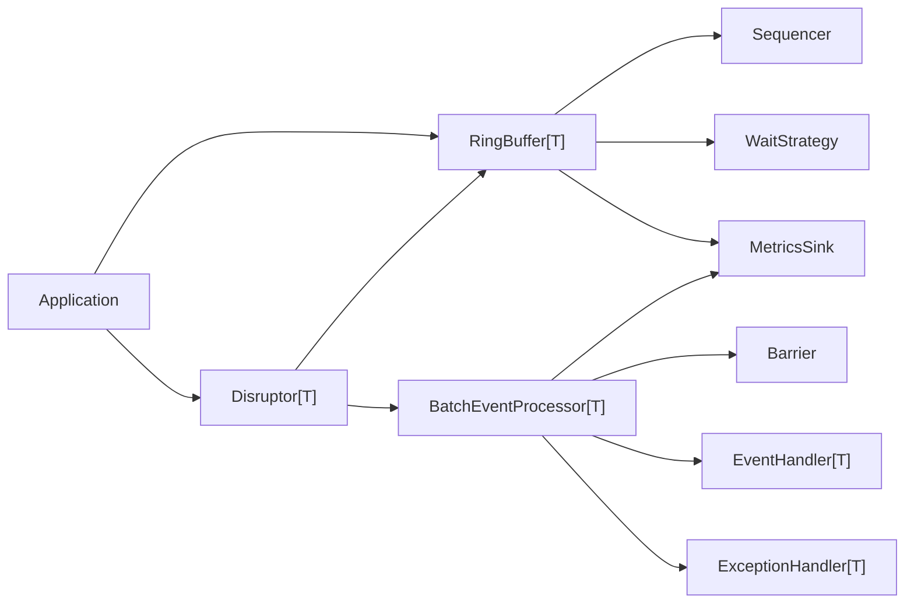
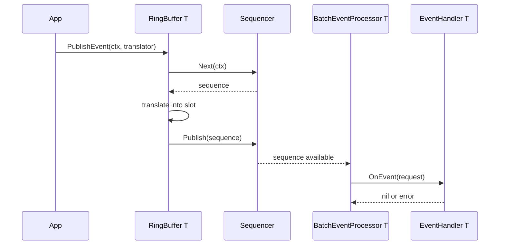
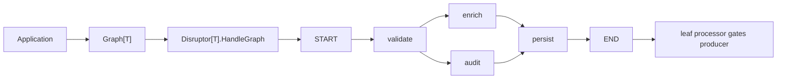
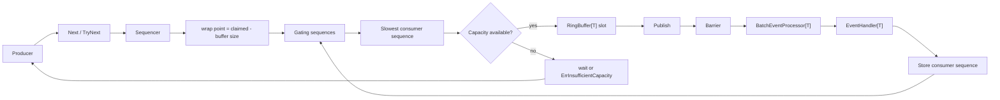

# disruptor.go

English | [中文](README.zh-CN.md)

High-performance Disruptor pattern implementation for Go, with generic ring
buffers, cancellable sequencing, dependency graphs, recovery hooks, metrics,
examples, and benchmarks.

The public API favors interfaces and replaceable components. Core algorithms can
evolve internally without forcing users to rewrite producers, consumers, metrics
adapters, or recovery policies.

## Install

```bash
go get github.com/photowey/disruptor.go/pkg/disruptor
```

Import the public package:

```go
import "github.com/photowey/disruptor.go/pkg/disruptor"
```

## Quick Start

### Fan-Out

```go
package main

import (
    "context"
    "fmt"

    "github.com/photowey/disruptor.go/pkg/disruptor"
)

type LongEvent struct {
    Value int64
}

type LongEventFactory struct{}

func (LongEventFactory) NewEvent() LongEvent {
    return LongEvent{}
}

type LongEventHandler struct {
    Done chan<- int64
}

func (h LongEventHandler) OnEvent(
    request disruptor.EventRequest[LongEvent],
) error {
    h.Done <- request.Event.Value
    return nil
}

type LongEventTranslator struct {
    Value int64
}

func (t LongEventTranslator) Translate(
    request disruptor.TranslateRequest[LongEvent],
) {
    request.Event.Value = t.Value
}

func main() {
    ctx := context.Background()

    d, err := disruptor.New(
        LongEventFactory{},
        1024,
    )
    if err != nil {
        panic(err)
    }

    done := make(chan int64, 1)
    _, err = d.HandleEventsWith(LongEventHandler{Done: done})
    if err != nil {
        panic(err)
    }
    if err := d.Start(ctx); err != nil {
        panic(err)
    }

    err = d.RingBuffer().PublishEvent(ctx, LongEventTranslator{Value: 42})
    if err != nil {
        panic(err)
    }

    fmt.Println(<-done)

    d.Stop()
    if err := d.Wait(); err != nil {
        panic(err)
    }
}
```

### Graph Dependencies

Use `Graph[T]` when handlers must run in dependency order. Graph mode and
fan-out mode are mutually exclusive on one `Disruptor`, so build a fresh
instance for graph processing. A complete runnable version lives in
`examples/graph_quickstart`.

```go
type GraphStepHandler struct {
    Steps chan<- string
}

func (h GraphStepHandler) OnEvent(
    request disruptor.EventRequest[LongEvent],
) error {
    h.Steps <- fmt.Sprintf("%s:%d", request.Node.NodeName, request.Event.Value)
    return nil
}

steps := make(chan string, 2)
graph := disruptor.MustGraph[LongEvent]("quickstart").
    MustNode("validate", GraphStepHandler{Steps: steps}).
    MustNode("persist", GraphStepHandler{Steps: steps}).
    MustEdge(disruptor.GraphStartNode, "validate").
    MustEdge("validate", "persist").
    MustEdge("persist", disruptor.GraphEndNode)

graphDisruptor, err := disruptor.New(LongEventFactory{}, 1024)
if err != nil {
    panic(err)
}

_, err = graphDisruptor.HandleGraph(graph)
if err != nil {
    panic(err)
}
```

## API Shape

- `RingBuffer[T]` is the low-level API for claiming, mutating, and publishing
  preallocated event slots.
- `Disruptor[T]` is the high-level facade for one ring buffer with managed
  processors.
- `HandleEventsWith` wires the V1 fan-out mode where every consumer receives
  every event.
- `Graph[T]` and `HandleGraph` wire V1.1 dependency topologies such as
  pipelines, fan-in, fan-out, and diamond graphs.
- `RuntimeGraph[T]` and `HandleRuntimeGraph` wire V1.2 conditional routing
  graphs where each event may activate a different path.
- `EventFactory[T]`, `EventTranslator[T]`, `EventHandler[T]`,
  `ExceptionHandler[T]`, `WaitStrategy`, and `MetricsSink` are interfaces.
- `XxxFunc` adapters are available where callbacks are useful without exposing
  anonymous function types in public signatures.
- `context.Context` is accepted by blocking producer and processor operations so
  waits can be cancelled.
- `ProducerTypeMulti` is the default; `ProducerTypeSingle` is a lighter path for
  one producer that publishes claimed sequences in order.

## Architecture



## Event Flow



## Topology Graphs

`Graph[T]` models explicit handler dependencies. The graph is constructed before
`Start`, registered once through `HandleGraph`, and then frozen so the running
topology remains inspectable.



Graph processors still consume from the same ring buffer. Source nodes wait on
the cursor; downstream nodes wait on their upstream sequences. Producer
backpressure is attached to leaf nodes only. `START` and `END` are built-in
terminal nodes, but terminal edges must be declared explicitly. `Snapshot`,
`Mermaid`, and `DOT` include the virtual terminals and declared terminal edges;
processor registration still creates processors for real handler nodes only.

## Runtime Graphs

`RuntimeGraph[T]` is separate from static `Graph[T]`. It evaluates edge
conditions for each event and executes only selected handler paths. Handlers can
write event-scoped runtime variables; expression edges read those variables.

```go
type RouteHandler struct {
    Steps chan<- string
}

func (h RouteHandler) OnEvent(
    request disruptor.EventRequest[LongEvent],
) error {
    request.Runtime.Set("route.fast", true)
    request.Runtime.Set("route.audit", false)
    h.Steps <- "route"
    return nil
}

runtimeGraph := disruptor.MustRuntimeGraph[LongEvent]("runtime-route").
    MustNode("route", RouteHandler{Steps: steps}).
    MustNode("fast", GraphStepHandler{Steps: steps}).
    MustNode("audit", GraphStepHandler{Steps: steps}).
    MustEdge(disruptor.GraphStartNode, "route").
    MustEdge("route", "fast", disruptor.WhenExpression[LongEvent](`${route.fast}`)).
    MustEdge("route", "audit", disruptor.WhenExpression[LongEvent](`${route.audit}`)).
    MustEdge("fast", disruptor.GraphEndNode).
    MustEdge("audit", disruptor.GraphEndNode)

_, err = d.HandleRuntimeGraph(runtimeGraph)
```

Runtime expressions support bools, strings, numeric comparisons, grouping,
logical operators, and integer bitwise operators such as `${flags} & 1`.

## Backpressure

A producer can claim a slot only when the wrap point stays behind the slowest
gating sequence. This prevents unconsumed event slots from being overwritten.



## Layout

The public package is `pkg/disruptor`. Internal algorithm boundaries live under
`internal/`:

```text
internal/
  availability/   contiguous publication scanning
  padding/        cache-line padding primitives with GOARCH defaults
  sequencer/      sequence primitive plus single/multi producer sequencers

pkg/disruptor/    public API, ring buffer facade, barriers, processors, metrics
benchmarks/       end-to-end, topology, and comparison benchmarks
examples/         runnable usage examples
docs/             API and design documentation
```

`pkg/disruptor.Sequence` is re-exported from `internal/sequencer`, so external
users get a stable public type while internal sequencing algorithms remain
replaceable.

Cache-line padding follows Go's per-architecture approximation by default:
32-byte, 64-byte, 128-byte, and 256-byte layouts are selected at compile time.
Override tags are available for benchmarking or unusual targets:
`disruptor_cacheline_32`, `disruptor_cacheline_64`, `disruptor_cacheline_128`,
and `disruptor_cacheline_256`.

## Recovery

The default exception handler is fail-fast. You can replace it with ignore or
bounded retry behavior:

```go
retryHandler, err := disruptor.NewRetryExceptionHandler[LongEvent](
    2,
    disruptor.ExceptionActionHalt,
)
if err != nil {
    panic(err)
}

_, err = d.HandleEventsWithOptions(
    []disruptor.EventHandler[LongEvent]{handler},
    disruptor.WithExceptionHandler[LongEvent](retryHandler),
)
```

Handler panics are recovered and routed through the same exception handler path.
Producer translator panics still publish the claimed sequence first, then
re-panic to the caller so consumers do not get stuck behind an unpublished slot.

## Metrics

Metrics are opt-in and backend-neutral. The default sink is nil, so hot paths
short-circuit before measuring or dispatching.

```go
type CountingMetricsSink struct{}

func (CountingMetricsSink) OnPublish(metric disruptor.PublishMetric) {}
func (CountingMetricsSink) OnBatchStart(metric disruptor.BatchMetric) {}
func (CountingMetricsSink) OnEventHandled(metric disruptor.EventMetric) {}
func (CountingMetricsSink) OnWait(metric disruptor.WaitMetric) {}
func (CountingMetricsSink) OnProcessorState(metric disruptor.ProcessorMetric) {}
```

## Examples

Runnable examples live under `examples/`:

- `examples/basic`
- `examples/multi_consumer`
- `examples/metrics`
- `examples/error_recovery`
- `examples/batch_publish`
- `examples/single_producer`
- `examples/graph_quickstart`
- `examples/pipeline`
- `examples/diamond`
- `examples/graph_export`
- `examples/runtime_graph`

Run one with:

```bash
go run ./examples/basic
go run ./examples/graph_quickstart
```

## Benchmarks

Benchmarks are part of release readiness:

```bash
go test ./...
go test -race ./...
go test -run '^$' -bench=. -benchmem -benchtime=100ms -count=10 -cpu=1,2,4,8 ./...
go test -run '^$' -bench=BenchmarkE2ELatencyQuantiles -benchmem -count=10 ./benchmarks
benchstat benchmarks/baseline/baseline.txt /tmp/disruptor-new.txt
```

See `benchmarks/README.md` for end-to-end, M/N producer-consumer, graph
topology, runtime graph routing, channel, `sync.Cond`, baseline, and
tail-latency groups.

Channels remain the right default for ordinary ownership transfer and simple
synchronization. Use this library when benchmarks show that you need high
throughput, low allocation, broadcast-to-many consumers, or controlled
backpressure.
