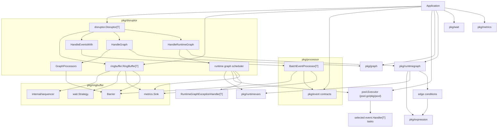
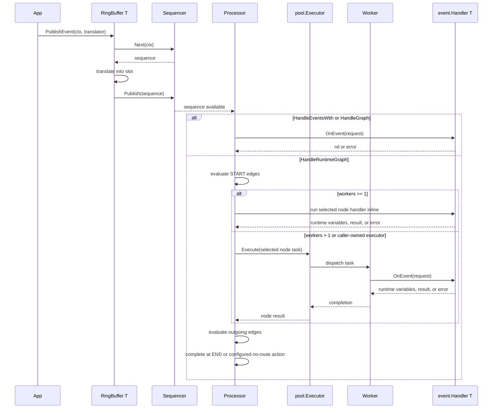
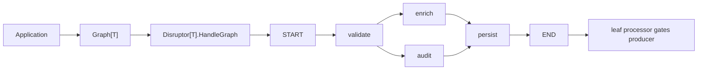
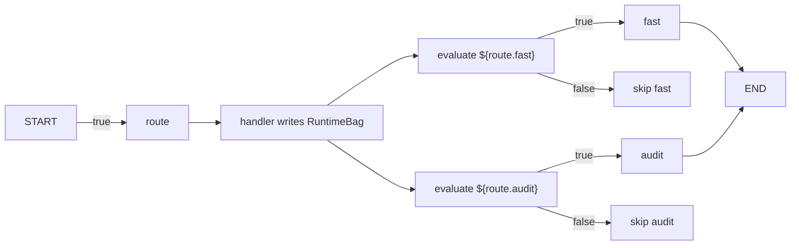
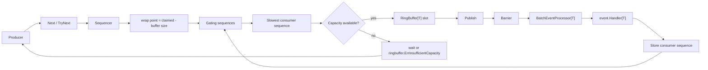

# disruptor.go

English | [中文](README.zh-CN.md)

High-performance Disruptor pattern implementation for Go, with generic ring
buffers, cancellable sequencing, dependency graphs, recovery hooks, metrics,
examples, and benchmarks.

The public API favors interfaces and replaceable components. Core algorithms can
evolve internally without forcing users to rewrite producers, consumers, metrics
adapters, or recovery policies.

## Install

```bash
go get github.com/photowey/disruptor.go
```

Import the packages you use:

```go
import (
    "github.com/photowey/disruptor.go/pkg/disruptor"
    "github.com/photowey/disruptor.go/pkg/event"
    "github.com/photowey/disruptor.go/pkg/metrics"
    "github.com/photowey/disruptor.go/pkg/processor"
    "github.com/photowey/disruptor.go/pkg/ringbuffer"
    topology "github.com/photowey/disruptor.go/pkg/graph"
    "github.com/photowey/disruptor.go/pkg/runtimegraph"
    "github.com/photowey/disruptor.go/pkg/wait"
)
```

## Quick Start

### Fan-Out

```go
package main

import (
    "context"
    "fmt"

    "github.com/photowey/disruptor.go/pkg/disruptor"
    "github.com/photowey/disruptor.go/pkg/event"
)

type LongEvent struct {
    Value int64
}

type LongEventFactory struct{}

func (LongEventFactory) NewEvent() LongEvent {
    return LongEvent{}
}

type LongEventHandler struct {
    Done chan<- int64
}

func (h LongEventHandler) OnEvent(
    request event.Request[LongEvent],
) error {
    h.Done <- request.Event.Value
    return nil
}

type LongEventTranslator struct {
    Value int64
}

func (t LongEventTranslator) Translate(
    request event.TranslateRequest[LongEvent],
) {
    request.Event.Value = t.Value
}

func main() {
    ctx := context.Background()

    d, err := disruptor.New(
        LongEventFactory{},
        1024,
    )
    if err != nil {
        panic(err)
    }

    done := make(chan int64, 1)
    _, err = d.HandleEventsWith(LongEventHandler{Done: done})
    if err != nil {
        panic(err)
    }
    if err := d.Start(ctx); err != nil {
        panic(err)
    }

    err = d.RingBuffer().PublishEvent(ctx, LongEventTranslator{Value: 42})
    if err != nil {
        panic(err)
    }

    fmt.Println(<-done)

    d.Stop()
    if err := d.Wait(); err != nil {
        panic(err)
    }
}
```

### Graph Dependencies

Use `Graph[T]` when handlers must run in dependency order. Graph mode and
fan-out mode are mutually exclusive on one `Disruptor`, so build a fresh
instance for graph processing. A complete runnable version lives in
`examples/graph_quickstart`.

```go
type GraphStepHandler struct {
    Steps chan<- string
}

func (h GraphStepHandler) OnEvent(
    request event.Request[LongEvent],
) error {
    h.Steps <- fmt.Sprintf("%s:%d", request.Node.NodeName, request.Event.Value)
    return nil
}

steps := make(chan string, 2)
graph := topology.Must[LongEvent]("quickstart").
    MustNode("validate", GraphStepHandler{Steps: steps}).
    MustNode("persist", GraphStepHandler{Steps: steps}).
    MustEdge(topology.StartNode, "validate").
    MustEdge("validate", "persist").
    MustEdge("persist", topology.EndNode)

graphDisruptor, err := disruptor.New(LongEventFactory{}, 1024)
if err != nil {
    panic(err)
}

_, err = graphDisruptor.HandleGraph(graph)
if err != nil {
    panic(err)
}
```

## API Shape

- `ringbuffer.RingBuffer[T]` is the low-level API for claiming, mutating, and
  publishing preallocated event slots.
- `disruptor.Disruptor[T]` is the high-level facade for one ring buffer with managed
  processors.
- `HandleEventsWith` wires the V1 fan-out mode where every consumer receives
  every event.
- `graph.Graph[T]` and `HandleGraph` wire V1.1 dependency topologies such as
  pipelines, fan-in, fan-out, and diamond graphs.
- `runtimegraph.RuntimeGraph[T]` and `HandleRuntimeGraph` wire V1.2 conditional
  routing graphs where each event may activate a different path.
- `event.Factory[T]`, `event.Translator[T]`, `event.Handler[T]`,
  `event.ExceptionHandler[T]`, `wait.Strategy`, and `metrics.Sink` are
  interfaces.
- `XxxFunc` adapters are available where callbacks are useful without exposing
  anonymous function types in public signatures.
- `context.Context` is accepted by blocking producer and processor operations so
  waits can be cancelled.
- `ProducerTypeMulti` is the default; `ProducerTypeSingle` is a lighter path for
  one producer that publishes claimed sequences in order.

## Architecture



## Event Flow

The publish path is shared by fan-out, static graph, and runtime graph modes.
Runtime graph routing starts after the scheduler processor observes an available
sequence.



## Topology Graphs

`Graph[T]` models explicit handler dependencies. The graph is constructed before
`Start`, registered once through `HandleGraph`, and then frozen so the running
topology remains inspectable.



Graph processors still consume from the same ring buffer. Source nodes wait on
the cursor; downstream nodes wait on their upstream sequences. Producer
backpressure is attached to leaf nodes only. `START` and `END` are built-in
terminal nodes, but terminal edges must be declared explicitly. `Snapshot`,
`Mermaid`, and `DOT` include the virtual terminals and declared terminal edges;
processor registration still creates processors for real handler nodes only.

## Runtime Graphs

`RuntimeGraph[T]` is separate from static `Graph[T]`. It evaluates edge
conditions for each event and executes only selected handler paths. Handlers can
write event-scoped runtime variables; expression edges read those variables.
`event.Request.Runtime` is reset between events and is scoped to the current
handler callback.

```go
type RouteHandler struct {
    Steps chan<- string
}

func (h RouteHandler) OnEvent(
    request event.Request[LongEvent],
) error {
    request.Runtime.Set("route.fast", true)
    request.Runtime.Set("route.audit", false)
    h.Steps <- "route"
    return nil
}

runtimeGraph := runtimegraph.MustRuntimeGraph[LongEvent]("runtime-route").
    MustNode("route", RouteHandler{Steps: steps}).
    MustNode("fast", GraphStepHandler{Steps: steps}).
    MustNode("audit", GraphStepHandler{Steps: steps}).
    MustEdge(topology.StartNode, "route").
    MustEdge("route", "fast", runtimegraph.WhenExpression[LongEvent](`${route.fast}`)).
    MustEdge("route", "audit", runtimegraph.WhenExpression[LongEvent](`${route.audit}`)).
    MustEdge("fast", topology.EndNode).
    MustEdge("audit", topology.EndNode)

_, err = d.HandleRuntimeGraph(runtimeGraph)
```

`RuntimeGraph` is deterministic by default. Independent selected nodes can run
concurrently when workers are configured explicitly:

```go
_, err = d.HandleRuntimeGraph(
    runtimeGraph,
    disruptor.WithRuntimeGraphWorkers[LongEvent](2),
)
```

With `workers > 1`, handler side effects and independent node completion order
are not deterministic. The scheduler still owns route state, edge evaluation,
joins, and sequence advancement. Advanced users can supply a caller-owned
`pool.Executor` from `github.com/photowey/pool.go/pkg/pool` through
`disruptor.WithRuntimeGraphExecutor`; Disruptor dispatches node work to that
executor but does not shut it down.

## External Pool

RuntimeGraph can execute selected node handlers through a caller-owned
`pool.Executor`. This keeps the disruptor core focused on routing, joins,
exception policy, and sequence advancement while letting applications choose the
bounded execution policy they already use elsewhere.

For a complete runnable walkthrough, see `examples/runtime_graph_executor`.

```go
exec, err := pool.NewFixed(
    4,
    pool.WithQueueSize(4),
    pool.WithRejectPolicy(pool.RejectPolicyReject),
)
if err != nil {
    return err
}
defer exec.Shutdown(ctx)

_, err = d.HandleRuntimeGraph(
    runtimeGraph,
    disruptor.WithRuntimeGraphExecutor[LongEvent](exec),
)
```

Executors passed through `WithRuntimeGraphExecutor` are caller-owned. Disruptor
does not shut them down. Executors created internally from
`WithRuntimeGraphWorkers` are shut down by Disruptor.

Runtime expressions support bools, strings, numeric comparisons, grouping,
logical operators, and integer bitwise operators such as `${flags} & 1`.
The default event resolver and any custom runtime variable source can also
implement `runtimevars.TypedResolver[T]` or `runtimevars.TypedVariables` so
scalar values stay on the typed path before the expression engine boxes them.
Default numeric comparison stays lightweight for the routing hot path: signed
and unsigned integers compare exactly, while float operands use Go `float64`
semantics. Domain numbers such as decimals, money, or big numbers are handled
through `expression.WithNumberAdapter(adapter)`. A number adapter can convert
ordinary or typed object variables into `ValueNumber`, compare custom numbers,
and convert a final custom number result to bool. Decimal semantics remain
adapter-owned and are not part of the core module dependency graph.



## Backpressure

A producer can claim a slot only when the wrap point stays behind the slowest
gating sequence. This prevents unconsumed event slots from being overwritten.



## Layout

Public packages are split by responsibility. `pkg/disruptor` owns high-level
orchestration; the other packages own low-level infrastructure, replaceable
contracts, and graph-specific builders:

```text
pkg/disruptor/    facade orchestration for fan-out, static graph, and runtime graph
pkg/event/        handler requests, lifecycle hooks, exception handlers
pkg/sequence/     public sequence type and readers
pkg/wait/         wait strategy interface and built-in blocking/busy-spin strategies
pkg/metrics/      backend-neutral metrics sink and payloads
pkg/ringbuffer/   preallocated event storage, barriers, producer options
pkg/processor/    event processor lifecycle and processor options
pkg/graph/        static dependency graph builder, validation, snapshots, export
pkg/runtimegraph/ conditional routing graph builder and edge conditions
pkg/expression/   bool expression compiler used by runtime graph edges
pkg/runtimevars/  concurrent runtime variables and event value resolution

internal/
  availability/   contiguous publication scanning
  padding/        cache-line padding primitives with GOARCH defaults
  sequencer/      sequence primitive plus single/multi producer sequencers

benchmarks/       end-to-end, topology, and comparison benchmarks
examples/         runnable usage examples
docs/             API and design documentation
```

`pkg/sequence.Sequence` is the stable public sequence type. The concrete
single-producer and multi-producer sequencing algorithms remain in `internal`.

Cache-line padding follows Go's per-architecture approximation by default:
32-byte, 64-byte, 128-byte, and 256-byte layouts are selected at compile time.
Override tags are available for benchmarking or unusual targets:
`disruptor_cacheline_32`, `disruptor_cacheline_64`, `disruptor_cacheline_128`,
and `disruptor_cacheline_256`.

## Recovery

The default exception handler is fail-fast. You can replace it with ignore or
bounded retry behavior:

```go
retryHandler, err := event.NewRetryExceptionHandler[LongEvent](
    2,
    event.ExceptionActionHalt,
)
if err != nil {
    panic(err)
}

_, err = d.HandleEventsWithOptions(
    []event.Handler[LongEvent]{handler},
    processor.WithExceptionHandler[LongEvent](retryHandler),
)
```

Handler panics are recovered and routed through the same exception handler path.
Producer translator panics still publish the claimed sequence first, then
re-panic to the caller so consumers can continue past the claimed slot.

## Metrics

Metrics are opt-in and backend-neutral. The default sink is nil, so hot paths
short-circuit before measuring or dispatching.

```go
type CountingMetricsSink struct{}

func (CountingMetricsSink) OnPublish(metric metrics.PublishMetric) {}
func (CountingMetricsSink) OnBatchStart(metric metrics.BatchMetric) {}
func (CountingMetricsSink) OnEventHandled(metric metrics.EventMetric) {}
func (CountingMetricsSink) OnWait(metric metrics.WaitMetric) {}
func (CountingMetricsSink) OnProcessorState(metric metrics.ProcessorMetric) {}
```

## Examples

Runnable examples live under `examples/`:

- `examples/basic`
- `examples/multi_consumer`
- `examples/metrics`
- `examples/error_recovery`
- `examples/batch_publish`
- `examples/single_producer`
- `examples/graph_quickstart`
- `examples/pipeline`
- `examples/diamond`
- `examples/graph_export`
- `examples/runtime_graph`
- `examples/runtime_graph_executor`

Run one with:

```bash
go run ./examples/basic
go run ./examples/graph_quickstart
```

## Benchmarks

Benchmarks are part of release readiness:

```bash
go test ./...
go test -race ./...
go test -run '^$' -bench=. -benchmem -benchtime=100ms -count=10 -cpu=1,2,4,8 ./...
go test -run '^$' -bench=BenchmarkE2ELatencyQuantiles -benchmem -count=10 ./benchmarks
benchstat benchmarks/baseline/baseline.txt /tmp/disruptor-new.txt
```

See `benchmarks/README.md` for end-to-end, M/N producer-consumer, graph
topology, runtime graph routing, channel, `sync.Cond`, baseline, and
tail-latency groups.

Channels remain the right default for ordinary ownership transfer and simple
synchronization. Use this library when benchmarks show that you need high
throughput, low allocation, broadcast-to-many consumers, or controlled
backpressure.
