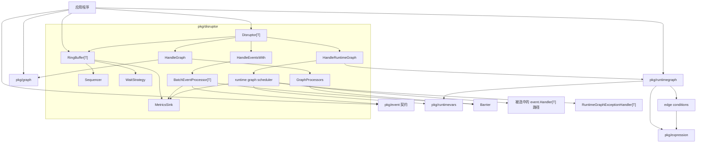
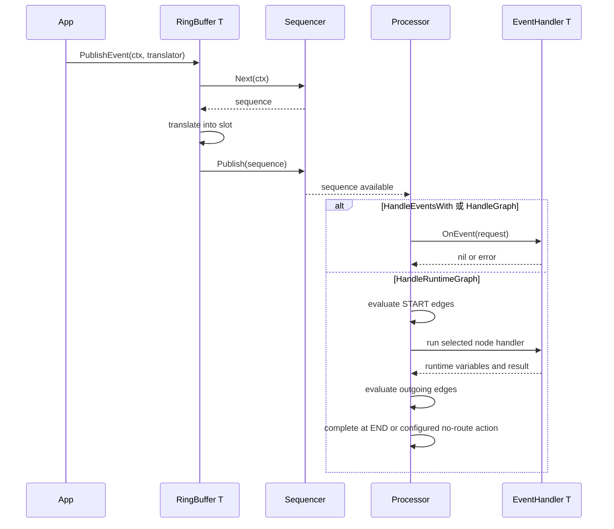
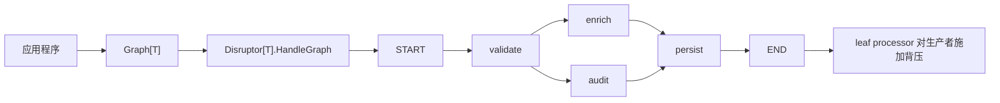
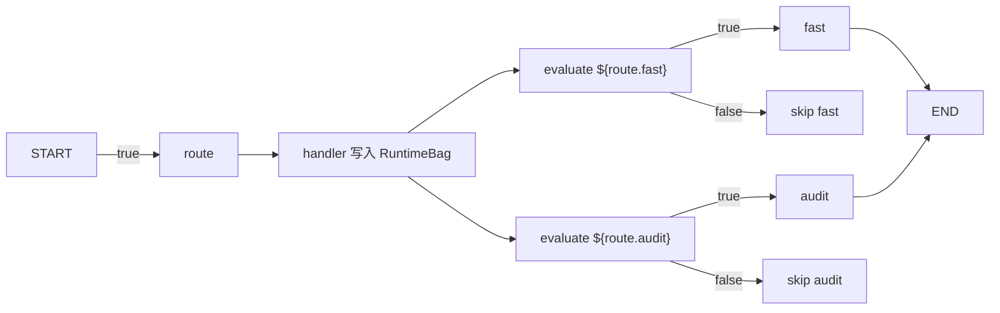
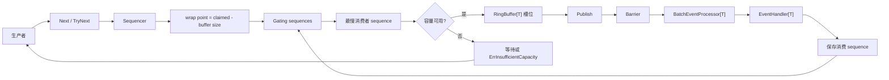

# disruptor.go

[English](README.md) | 中文

`disruptor.go` 是 Go 版本的高性能 Disruptor 模式实现，提供泛型
Ring Buffer、可取消的序列申请、依赖拓扑图、异常恢复、指标钩子、示例和
benchmark。

公共 API 以接口为核心，用户可以无缝替换 factory、translator、handler、
exception handler、wait strategy 和 metrics sink。核心算法可以在内部演进，
而不迫使使用方重写生产者、消费者、指标适配器或恢复策略。

## 安装

```bash
go get github.com/photowey/disruptor.go
```

按需导入公共包：

```go
import (
    "github.com/photowey/disruptor.go/pkg/disruptor"
    "github.com/photowey/disruptor.go/pkg/event"
    topology "github.com/photowey/disruptor.go/pkg/graph"
    "github.com/photowey/disruptor.go/pkg/runtimegraph"
)
```

## 快速开始

### Fan-Out

```go
package main

import (
    "context"
    "fmt"

    "github.com/photowey/disruptor.go/pkg/disruptor"
    "github.com/photowey/disruptor.go/pkg/event"
)

type LongEvent struct {
    Value int64
}

type LongEventFactory struct{}

func (LongEventFactory) NewEvent() LongEvent {
    return LongEvent{}
}

type LongEventHandler struct {
    Done chan<- int64
}

func (h LongEventHandler) OnEvent(
    request event.Request[LongEvent],
) error {
    h.Done <- request.Event.Value
    return nil
}

type LongEventTranslator struct {
    Value int64
}

func (t LongEventTranslator) Translate(
    request disruptor.TranslateRequest[LongEvent],
) {
    request.Event.Value = t.Value
}

func main() {
    ctx := context.Background()

    d, err := disruptor.New(LongEventFactory{}, 1024)
    if err != nil {
        panic(err)
    }

    done := make(chan int64, 1)
    _, err = d.HandleEventsWith(LongEventHandler{Done: done})
    if err != nil {
        panic(err)
    }
    if err := d.Start(ctx); err != nil {
        panic(err)
    }

    err = d.RingBuffer().PublishEvent(ctx, LongEventTranslator{Value: 42})
    if err != nil {
        panic(err)
    }

    fmt.Println(<-done)

    d.Stop()
    if err := d.Wait(); err != nil {
        panic(err)
    }
}
```

### Graph 依赖

当 handler 必须按依赖顺序运行时，使用 `Graph[T]`。Graph mode 和 fan-out
mode 在同一个 `Disruptor` 实例上互斥，因此 graph 处理需要使用一个新的实例。
完整可运行版本位于 `examples/graph_quickstart`。

```go
type GraphStepHandler struct {
    Steps chan<- string
}

func (h GraphStepHandler) OnEvent(
    request event.Request[LongEvent],
) error {
    h.Steps <- fmt.Sprintf("%s:%d", request.Node.NodeName, request.Event.Value)
    return nil
}

steps := make(chan string, 2)
graph := topology.Must[LongEvent]("quickstart").
    MustNode("validate", GraphStepHandler{Steps: steps}).
    MustNode("persist", GraphStepHandler{Steps: steps}).
    MustEdge(topology.StartNode, "validate").
    MustEdge("validate", "persist").
    MustEdge("persist", topology.EndNode)

graphDisruptor, err := disruptor.New(LongEventFactory{}, 1024)
if err != nil {
    panic(err)
}

_, err = graphDisruptor.HandleGraph(graph)
if err != nil {
    panic(err)
}
```

## API 形态

- `RingBuffer[T]` 是底层 API，用于申请、修改和发布预分配事件槽。
- `Disruptor[T]` 是高层门面，围绕一个 Ring Buffer 管理 processor。
- `HandleEventsWith` 负责 V1 fan-out 模式，每个消费者都会收到全部事件。
- `graph.Graph[T]` 和 `HandleGraph` 负责 V1.1 依赖拓扑，例如 pipeline、fan-in、fan-out 和 diamond graph。
- `runtimegraph.RuntimeGraph[T]` 和 `HandleRuntimeGraph` 负责 V1.2 条件路由图，每个事件可以激活不同路径。
- `disruptor.EventFactory[T]`、`disruptor.EventTranslator[T]`、`event.Handler[T]`、`event.ExceptionHandler[T]`、`disruptor.WaitStrategy` 和 `disruptor.MetricsSink` 都是接口。
- `XxxFunc` 适配器仍然可用，适合快速桥接回调；正式示例优先展示命名类型，避免公开用法过度依赖匿名函数。
- 阻塞生产者和处理器路径都接受 `context.Context`，等待过程可以被取消。
- 默认生产者类型是 `ProducerTypeMulti`；单生产者场景可以使用 `ProducerTypeSingle` 获得更轻的顺序发布路径。

## 架构



## 流转流程

发布路径由 fan-out、静态 Graph 和 Runtime Graph 共享。Runtime Graph 的
条件路由发生在 scheduler processor 观察到可消费 sequence 之后。



## 拓扑图

`Graph[T]` 用显式节点和边描述 handler 依赖。Graph 必须在 `Start` 前构建，
通过 `HandleGraph` 注册一次后会被冻结，因此运行中的拓扑仍然可以被快照、
导出和排查。



Graph processor 仍然消费同一个 Ring Buffer。source 节点等待 cursor，
下游节点等待上游 sequence。生产者背压只挂在 leaf 节点上。`START` 和
`END` 是内置虚拟终端节点，但终端边必须由开发者显式声明。`Snapshot`、
`Mermaid` 和 `DOT` 会包含虚拟终端节点以及显式终端边；processor 注册仍然
只为真实 handler 节点创建 processor。

## Runtime Graph

`RuntimeGraph[T]` 和静态 `Graph[T]` 是两套 API。它会针对每个事件计算边
条件，只执行被选中的 handler 路径。handler 可以写入事件级 runtime
variables，表达式边再读取这些变量。

```go
type RouteHandler struct {
    Steps chan<- string
}

func (h RouteHandler) OnEvent(
    request event.Request[LongEvent],
) error {
    request.Runtime.Set("route.fast", true)
    request.Runtime.Set("route.audit", false)
    h.Steps <- "route"
    return nil
}

runtimeGraph := runtimegraph.MustRuntimeGraph[LongEvent]("runtime-route").
    MustNode("route", RouteHandler{Steps: steps}).
    MustNode("fast", GraphStepHandler{Steps: steps}).
    MustNode("audit", GraphStepHandler{Steps: steps}).
    MustEdge(topology.StartNode, "route").
    MustEdge("route", "fast", runtimegraph.WhenExpression[LongEvent](`${route.fast}`)).
    MustEdge("route", "audit", runtimegraph.WhenExpression[LongEvent](`${route.audit}`)).
    MustEdge("fast", topology.EndNode).
    MustEdge("audit", topology.EndNode)

_, err = d.HandleRuntimeGraph(runtimeGraph)
```

runtime 表达式支持 bool、字符串、数值比较、分组、逻辑运算，以及
`${flags} & 1` 这类整数位运算。



## 背压

生产者只有在 `wrap point` 没有超过最慢消费者 sequence 时才能继续申请槽位，
避免覆盖尚未消费的事件槽。



## 项目布局

公共包按职责拆分。`pkg/disruptor` 负责 Ring Buffer 和 processor 编排；
其他包负责可替换契约、拓扑构建和 runtime graph 所需能力：

```text
pkg/disruptor/    ring buffer、facade、barrier、processor、wait strategy、metrics
pkg/event/        handler request、生命周期 hook、exception handler
pkg/graph/        静态依赖图构建、校验、快照和导出
pkg/runtimegraph/ 条件路由图构建和边条件
pkg/expression/   runtime graph 边使用的 bool 表达式编译器
pkg/runtimevars/  并发 runtime 变量和事件值解析

internal/
  availability/   连续发布扫描
  padding/        按 GOARCH 选择的 cache-line padding 原语
  sequencer/      sequence 原语以及 single/multi producer sequencer

benchmarks/       端到端、拓扑和对比 benchmark
examples/         可运行示例
docs/             API 和设计文档
```

`pkg/disruptor.Sequence` 从 `internal/sequencer` 重新导出，因此外部用户拿到的是稳定公共类型，而内部 sequencing 算法仍可替换。

Cache-line padding 默认按 Go 架构近似选择：32、64、128、256 字节布局会在编译期选择。也可以用构建标签覆盖，用于 benchmark 或特殊目标：
`disruptor_cacheline_32`、`disruptor_cacheline_64`、`disruptor_cacheline_128`、`disruptor_cacheline_256`。

## 异常恢复

默认异常处理器是 fail-fast。你可以替换为 ignore 或有界 retry：

```go
retryHandler, err := event.NewRetryExceptionHandler[LongEvent](
    2,
    event.ExceptionActionHalt,
)
if err != nil {
    panic(err)
}

_, err = d.HandleEventsWithOptions(
    []event.Handler[LongEvent]{handler},
    disruptor.WithExceptionHandler[LongEvent](retryHandler),
)
```

handler panic 会被恢复，并进入相同的 exception handler 路径。producer translator panic 会先发布已申请的 sequence，再向调用者重新 panic，避免消费者卡在未发布槽位后面。

## 指标

指标是可选、后端无关的。默认 sink 为 nil，因此热路径会在测量和分发前短路。

```go
type CountingMetricsSink struct{}

func (CountingMetricsSink) OnPublish(metric disruptor.PublishMetric) {}
func (CountingMetricsSink) OnBatchStart(metric disruptor.BatchMetric) {}
func (CountingMetricsSink) OnEventHandled(metric disruptor.EventMetric) {}
func (CountingMetricsSink) OnWait(metric disruptor.WaitMetric) {}
func (CountingMetricsSink) OnProcessorState(metric disruptor.ProcessorMetric) {}
```

## 示例

可运行示例位于 `examples/`：

- `examples/basic`
- `examples/multi_consumer`
- `examples/metrics`
- `examples/error_recovery`
- `examples/batch_publish`
- `examples/single_producer`
- `examples/graph_quickstart`
- `examples/pipeline`
- `examples/diamond`
- `examples/graph_export`
- `examples/runtime_graph`

运行示例：

```bash
go run ./examples/basic
go run ./examples/graph_quickstart
```

## Benchmark

Benchmark 是发布就绪的一部分：

```bash
go test ./...
go test -race ./...
go test -run '^$' -bench=. -benchmem -benchtime=100ms -count=10 -cpu=1,2,4,8 ./...
go test -run '^$' -bench=BenchmarkE2ELatencyQuantiles -benchmem -count=10 ./benchmarks
benchstat benchmarks/baseline/baseline.txt /tmp/disruptor-new.txt
```

更多端到端、M/N 生产消费、graph topology、runtime graph routing、
channel、`sync.Cond`、baseline 和尾延迟分组见 `benchmarks/README.md`。

普通所有权转移和简单同步仍然优先使用 channel。只有当 benchmark 证明你需要高吞吐、低分配、广播给多个消费者或可控背压时，再使用这个库。
