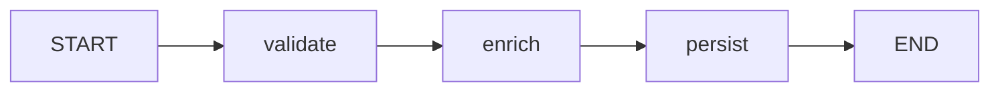
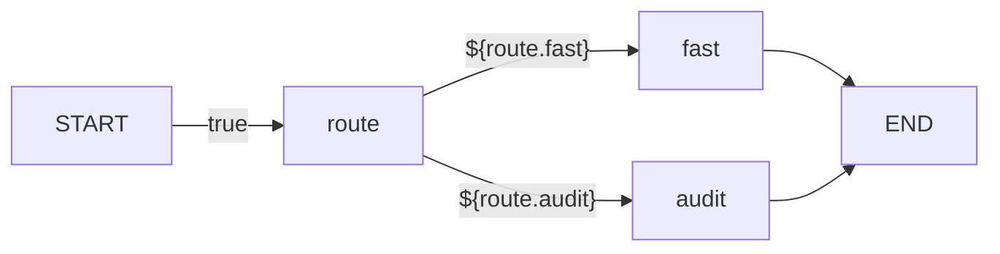
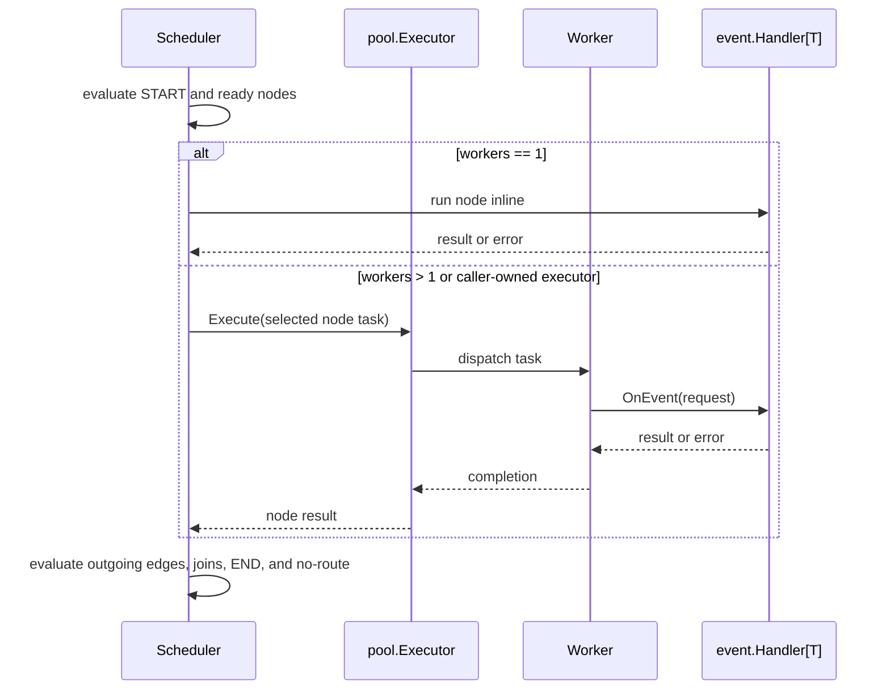

# API Guide

This guide documents the public V1 through V1.4 surface. The API is split by
responsibility:

- `pkg/disruptor`: high-level facade orchestration for fan-out, static graph,
  and runtime graph
- `pkg/ringbuffer`: preallocated event storage, producer options, and barriers
- `pkg/processor`: event processor lifecycle and processor options
- `pkg/wait`: wait strategy interface and built-in strategies
- `pkg/metrics`: backend-neutral metrics sink and payloads
- `pkg/sequence`: public sequence type and readers
- `pkg/event`: handler requests, lifecycle hooks, exception handlers
- `pkg/graph`: static dependency graph builder, validation, snapshots, export
- `pkg/runtimegraph`: conditional graph builder and edge conditions
- `pkg/expression`: bool expression compiler
- `pkg/runtimevars`: runtime variables and event value resolution

## Event Storage

`ringbuffer.RingBuffer[T]` preallocates value slots in `[]T` and returns
pointers to those slots. Producers and consumers mutate or read the ring slot
directly instead of copying generic values.

```go
type LongEvent struct {
    Value int64
}

type LongEventFactory struct{}

func (LongEventFactory) NewEvent() LongEvent {
    return LongEvent{}
}

rb, err := ringbuffer.New(LongEventFactory{}, 1024)
if err != nil {
    return err
}

event := rb.Get(0)
event.Value = 42
```

For quick adapters, `pkg/event` exposes `FactoryFunc[T]`, `TranslatorFunc[T]`,
and `HandlerFunc[T]`. Public examples use named types so production code can
keep dependencies explicit and replaceable.

## Low-Level Ring Buffer

Use `ringbuffer.RingBuffer[T]` when you want direct control over claim, mutate,
and publish steps.

```go
sequence, err := rb.Next(ctx)
if err != nil {
    return err
}

event := rb.Get(sequence)
event.Value = 42
rb.Publish(sequence)
```

Batched claims return the high sequence:

```go
hi, err := rb.NextN(ctx, 16)
if err != nil {
    return err
}

lo := hi - 16 + 1
for sequence := lo; sequence <= hi; sequence++ {
    rb.Get(sequence).Value = sequence
}
rb.PublishRange(lo, hi)
```

Non-blocking claims return `ErrInsufficientCapacity` when gating sequences would
be overrun:

```go
sequence, err := rb.TryNext()
if errors.Is(err, ringbuffer.ErrInsufficientCapacity) {
    return nil
}
if err != nil {
    return err
}

rb.Get(sequence).Value = 42
rb.Publish(sequence)
```

`TryNextN(n)` is the batched non-blocking form.

`PublishEvent` is the safe convenience path. After a successful claim, it always
publishes the claimed sequence, even if the translator panics.

```go
type LongEventTranslator struct {
    Value int64
}

func (t LongEventTranslator) Translate(
    request event.TranslateRequest[LongEvent],
) {
    request.Event.Value = t.Value
}

err := rb.PublishEvent(ctx, LongEventTranslator{Value: 42})
```

Backpressure is controlled by gating sequences:

```go
consumerSequence := sequence.New(sequence.InitialValue)
rb.AddGatingSequences(consumerSequence)
defer rb.RemoveGatingSequence(consumerSequence)
```

The high-level `disruptor.Disruptor[T]` and
`processor.BatchEventProcessor[T]` manage their own gating sequences.

## High-Level Disruptor

Use `disruptor.Disruptor[T]` for one ring buffer with managed processors. The
V1 fan-out mode wires parallel consumers where every handler receives every
event.

```go
type LongEventHandler struct {
    Done chan<- int64
}

func (h LongEventHandler) OnEvent(
    request event.Request[LongEvent],
) error {
    h.Done <- request.Event.Value
    return nil
}

d, err := disruptor.New(LongEventFactory{}, 1024)
if err != nil {
    return err
}

_, err = d.HandleEventsWith(LongEventHandler{Done: done})
if err != nil {
    return err
}

if err := d.Start(ctx); err != nil {
    return err
}
defer d.Stop()
```

`HandleEventsWith`, `HandleGraph`, and `HandleRuntimeGraph` are mutually
exclusive on one `Disruptor[T]` instance. Create a new disruptor when an
application needs separate fan-out, static graph, and runtime graph streams.

`HandleEventsWithOptions` attaches processor-specific options, currently
`processor.WithExceptionHandler[T](handler)`.

```go
retryHandler, err := event.NewRetryExceptionHandler[LongEvent](
    2,
    event.ExceptionActionHalt,
)
if err != nil {
    return err
}

_, err = d.HandleEventsWithOptions(
    []event.Handler[LongEvent]{LongEventHandler{Done: done}},
    processor.WithExceptionHandler[LongEvent](retryHandler),
)
```

`Wait` waits for all processors. If any processor fails, the facade stops peer
processors so `Wait` can return the collected terminal error instead of hanging.

```go
d.Stop()
if err := d.Wait(); err != nil {
    return err
}
```

## Event Processors

`processor.NewBatchEventProcessor` is the lower-level processor API. It is
useful when you need to wire barriers and dependencies yourself.

```go
barrier := rb.NewBarrier()
eventProcessor, err := processor.NewBatchEventProcessor(
    rb,
    barrier,
    LongEventHandler{Done: done},
)
if err != nil {
    return err
}
_ = eventProcessor
```

The processor adds its sequence as a ring-buffer gating sequence and removes it
when the processor exits.

## Topology Graphs

Use `Graph[T]` when a topology has dependencies between handlers. The graph is
constructed before `Start`, then registered through `HandleGraph`.



```go
graph := topology.Must[LongEvent]("order-pipeline").
    MustNode("validate", validateHandler).
    MustNode("enrich", enrichHandler).
    MustNode("persist", persistHandler).
    MustEdge(topology.StartNode, "validate").
    MustEdge("validate", "enrich").
    MustEdge("enrich", "persist").
    MustEdge("persist", topology.EndNode)

processors, err := d.HandleGraph(graph)
if err != nil {
    return err
}

if err := d.Start(ctx); err != nil {
    return err
}
defer d.Stop()

_ = processors
```

`Join` is a convenience for fan-in and fan-out edges:

```go
graph.Join("validate", "enrich").MustTo("persist")
```

`Snapshot`, `Mermaid`, and `DOT` include reserved virtual terminals:

- `graph.StartNode` has the value `START`.
- `graph.EndNode` has the value `END`.

The virtual terminals make exported graphs complete. They are not real handler
nodes and cannot be registered through `Node`. In V1.2, terminal edges are
explicit and must be declared manually through `Edge`:

```go
graph.MustEdge(topology.StartNode, "validate").
    MustEdge("persist", topology.EndNode)
```

`graph.Snapshot.Nodes` includes virtual `START` and `END` when the graph has
real nodes. `graph.Snapshot.Edges` includes only developer-declared edges.
`Sources` and `Leaves` list real handler nodes by real-node dependencies.
`Entries` lists real nodes targeted by `START -> node`; `Exits` lists real
nodes connected through `node -> END`. `Validate` requires `Entries` to match
`Sources` and `Exits` to match `Leaves`.

The graph API exposes named processors after registration:

```go
persist, ok := processors.Processor("persist")
sequence, ok := processors.Sequence("persist")
snapshot := processors.Snapshot()
```

`GraphProcessors` is read-only. The owning `Disruptor` still manages start,
stop, and wait.

Graph handlers receive lightweight node context on each request:

```go
type Node struct {
    GraphName string
    NodeName  string
    NodeLabel string
}
```

`event.Request`, `event.BatchStartRequest`, `event.Exception`,
`event.LifecycleException`, `metrics.BatchMetric`, `metrics.EventMetric`, and
`metrics.ProcessorMetric` also carry `event.Node` when they originate from
graph processors.

Graph mode uses its own exception semantics:

- `event.ExceptionActionContinue` advances the sequence and keeps the graph moving.
- `event.ExceptionActionRetry` retries the same sequence.
- `event.ExceptionActionHalt` is graph-terminal and does not advance the failed
  sequence.

Graph mode keeps producer backpressure on leaf processors only. Intermediate
processors remain barrier dependencies for downstream nodes, while producer
gating stays leaf-only.

`HandleGraph` freezes the graph instance. A handled graph cannot be mutated or
registered on another disruptor. Use `Snapshot`, `Mermaid`, or `DOT` before or
after registration when a topology needs to be logged or inspected.

## Runtime Graphs

Use `RuntimeGraph[T]` when each event may activate a different handler path.
Runtime graphs use the same explicit `START` and `END` terminal model as static
graphs, but each edge can have a condition.



```go
runtimeGraph := runtimegraph.MustRuntimeGraph[LongEvent]("runtime-route").
    MustNode("route", routeHandler).
    MustNode("fast", fastHandler).
    MustNode("audit", auditHandler).
    MustEdge(topology.StartNode, "route").
    MustEdge("route", "fast", runtimegraph.WhenExpression[LongEvent](`${route.fast}`)).
    MustEdge("route", "audit", runtimegraph.WhenExpression[LongEvent](`${route.audit}`)).
    MustEdge("fast", topology.EndNode).
    MustEdge("audit", topology.EndNode)

processors, err := d.HandleRuntimeGraph(runtimeGraph)
if err != nil {
    return err
}

_ = processors
```

Handlers receive `event.Request.Runtime`, a per-event runtime context. Handlers
can set variables:

```go
request.Runtime.Set("route.fast", true)
request.Runtime.Set("risk.score", 91)
```

The runtime context is scoped to the current `OnEvent` callback. Runtime graph
processors reset and reuse the concrete context between events to keep the hot
path allocation-free for non-expression routes. Handler code treats
`request.Runtime` as callback-scoped state.

Expression edges read the merged variable view. Lookup order is runtime bag,
configured `runtimevars.Provider[T]`, then configured event value resolver. The
default event resolver uses reflection and supports struct fields, JSON tags,
and string-keyed maps. It also implements `runtimevars.TypedResolver[T]` so
scalar values can reach the expression evaluator without first being boxed as
`any`. Custom variable sources can implement `runtimevars.TypedVariables` when
they need the same low-allocation expression path.

Runtime expressions support:

- bool, nil, string, integer, and float literals
- path lookups such as `${route.fast}` and `${risk.score}`
- comparisons: `==`, `!=`, `>`, `>=`, `<`, `<=`
- logical operators: `&&`, `||`, `!`
- grouping with parentheses
- integer bitwise operators: `&`, `|`, `^`, `&^`, `<<`, `>>`

Numeric comparison is optimized for routing decisions. Signed and unsigned
integers compare exactly, including mixed signed/unsigned comparisons. Float
operands use Go `float64` semantics. The built-in compiler does not provide
fixed-point decimal arithmetic by default.

Applications that require monetary, decimal, big-number, or other domain number
semantics register `expression.WithNumberAdapter(adapter)`. A
`NumberAdapter` combines conversion, comparison, and final bool conversion:

```go
type NumberAdapter interface {
    expression.ValueConverter
    expression.NumericComparator
    expression.NumberBoolConverter
}
```

Adapters can convert ordinary variables or typed object variables into
`expression.Value{Kind: expression.ValueNumber, Number: number}`. Built-in
`int`, `uint`, and `float` values stay on the default fast path before adapters
are consulted. Multiple adapters are deterministic: adapters implementing
`expression.OrderedNumberAdapter` run by ascending `Order()`, and equal orders
keep registration order.

The final expression result is converted to bool. Bool values are used directly,
integers use zero/non-zero truthiness, and strings use `strconv.ParseBool`.
Custom number-to-bool conversion is only applied to the final expression result.
Intermediate operands for `&&`, `||`, and `!` must already be bool.

Runtime graph no-route handling defaults to halt:

```go
_, err = d.HandleRuntimeGraph(
    runtimeGraph,
    disruptor.WithRuntimeGraphNoRouteAction[LongEvent](
        disruptor.RuntimeNoRouteActionComplete,
    ),
)
```

Runtime graph condition, no-route, and panic failures are routed through
`RuntimeGraphExceptionHandler[T]`. Handler errors use the node-level
`runtimegraph.WithNodeExceptionHandler[T]` override when present, otherwise they
also use `RuntimeGraphExceptionHandler[T]`. Panic recovery stays on the runtime
graph exception handler path.

Runtime graph execution is deterministic by default. `WithRuntimeGraphWorkers`
activates an internal fixed pool executor when `workers > 1`, allowing
independent ready nodes to run concurrently. The scheduler still owns edge
evaluation, joins, `END`, no-route handling, exception policy, and sequence
advancement. Worker goroutines only execute node handlers and return completion
messages to the scheduler.



```go
processors, err := d.HandleRuntimeGraph(
    runtimeGraph,
    disruptor.WithRuntimeGraphWorkers[LongEvent](2),
)
if err != nil {
    return err
}

_ = processors
```

With `workers > 1`, independent node ordering and handler side-effect ordering
are not deterministic. Handlers must be concurrency-safe. The runtime variable
bag is concurrency-safe, but concurrent writes to the same path use
last-write-wins semantics with nondeterministic write order.

Advanced users can supply a caller-owned pool executor:

```go
exec, err := pool.NewFixed(
    4,
    pool.WithQueueSize(4),
    pool.WithRejectPolicy(pool.RejectPolicyReject),
)
if err != nil {
    return err
}
defer exec.Shutdown(ctx)

_, err = d.HandleRuntimeGraph(
    runtimeGraph,
    disruptor.WithRuntimeGraphExecutor[LongEvent](exec),
)
```

Executors passed through `WithRuntimeGraphExecutor` are caller-owned. Disruptor
does not shut them down. Executors created internally from
`WithRuntimeGraphWorkers` are shut down by Disruptor.

## External Pool

`WithRuntimeGraphExecutor` accepts `pool.Executor` from
`github.com/photowey/pool.go/pkg/pool`. Disruptor uses that executor only for
selected RuntimeGraph node handler tasks. The RuntimeGraph scheduler still owns
edge evaluation, joins, no-route handling, exception policy, and sequence
advancement.

Use `examples/runtime_graph_executor` as the complete runnable example for
caller-owned executor lifecycle.

## Options

Ring buffer options:

- `ringbuffer.WithProducerType(ringbuffer.ProducerTypeSingle)` or
  `ringbuffer.WithProducerType(ringbuffer.ProducerTypeMulti)`
- `ringbuffer.WithWaitStrategy(strategy)`
- `ringbuffer.WithMetricsSink(sink)`

Processor options:

- `processor.WithExceptionHandler[T](handler)`

Graph options:

- `disruptor.WithGraphExceptionHandler[T](handler)`

Runtime graph builder and compiler options:

- `runtimegraph.WithExpressionCompiler(compiler)`
- `expression.NewCompiler(expression.WithValueConverter(converter))`
- `expression.NewCompiler(expression.WithNumberAdapter(adapter))`

Disruptor runtime graph options:

- `disruptor.WithRuntimeGraphExceptionHandler[T](handler)`
- `disruptor.WithRuntimeGraphWorkers[T](workers)`
- `disruptor.WithRuntimeGraphExecutor[T](executor)`
- `disruptor.WithRuntimeGraphNoRouteAction[T](action)`
- `disruptor.WithRuntimeGraphVariablesProvider[T](provider)`
- `disruptor.WithRuntimeGraphEventValueResolver[T](resolver)`
- `disruptor.WithRuntimeGraphMetricsSink[T](sink)`

`disruptor.WithRuntimeGraphWorkers(1)` keeps deterministic inline execution.
`disruptor.WithRuntimeGraphWorkers(workers)` with `workers > 1` creates an
internal fixed pool executor. `disruptor.WithRuntimeGraphWorkers` and
`disruptor.WithRuntimeGraphExecutor` cannot be used together.

Node options:

- `graph.WithNodeExceptionHandler[T](handler)`
- `graph.WithNodeLabel[T](label)`
- `graph.WithNodeMetadata[T](key, value)`
- `runtimegraph.WithNodeExceptionHandler[T](handler)`
- `runtimegraph.WithNodeLabel[T](label)`
- `runtimegraph.WithNodeMetadata[T](key, value)`

Options are separated by lifecycle stage so a processor option cannot be passed
to ring-buffer construction.

`ringbuffer.ProducerTypeMulti` is the default. It tracks claimed and published
sequences with per-slot availability metadata, so consumer visibility remains
contiguous across published sequences.

`ringbuffer.ProducerTypeSingle` is the lighter path for one producer goroutine.
It assumes the single producer publishes claimed sequences in order, including
batch ranges. Use `ringbuffer.ProducerTypeMulti` when multiple producers publish
concurrently or when publication can happen out of claim order.

`ringbuffer.ProducerTypeUnknown` and out-of-range producer values are rejected.
A nil wait strategy is rejected. A nil metrics sink disables metrics.

Graph node and graph names are trimmed before storage. They must not be empty or
contain control characters.

## Wait Strategies

Built-ins:

- `wait.NewBlockingStrategy()`
- `wait.NewBusySpinStrategy()`

Custom wait strategies implement:

```go
type Strategy interface {
    WaitFor(request wait.Request) (int64, error)
    WaitForCapacity(request wait.CapacityRequest) error
    SignalAll()
}
```

`wait.Request` carries the request context, requested sequence, cursor sequence,
dependent sequence, and barrier. `wait.CapacityRequest` is the public alias for
the sequencer capacity-wait payload. The payload style keeps the interface
stable when future fields are added.

## Event Handlers

Required:

```go
type Handler[T any] interface {
    OnEvent(request event.Request[T]) error
}
```

Optional:

```go
type BatchStartHandler interface {
    OnBatchStart(request event.BatchStartRequest) error
}

type LifecycleHandler interface {
    OnStart(ctx context.Context) error
    OnShutdown(ctx context.Context) error
}
```

The processor detects optional capabilities through type assertions. Panics from
`OnEvent`, `OnBatchStart`, `OnStart`, and `OnShutdown` are recovered into errors
and routed through the configured exception policy.

## Exception Handling

Default behavior is fail-fast:

```go
handler := event.NewFatalExceptionHandler[LongEvent]()
```

Built-ins:

- `event.NewFatalExceptionHandler[T]()` returns `event.ExceptionActionHalt`.
- `event.NewIgnoreExceptionHandler[T]()` returns `event.ExceptionActionContinue`.
- `event.NewRetryExceptionHandler[T](maxRetries, exhaustedAction)` retries a
  failed event up to `maxRetries` times before returning the exhausted action.

Actions:

- `event.ExceptionActionHalt`: stop the processor and return the error from `Wait`.
- `event.ExceptionActionContinue`: advance the failed sequence and continue.
- `event.ExceptionActionRetry`: retry the same sequence without advancing.

`event.NewRetryExceptionHandler` rejects negative retry counts. Its exhausted
action must be either `event.ExceptionActionHalt` or
`event.ExceptionActionContinue`.

## Metrics

`metrics.Sink` is backend-neutral:

```go
type Sink interface {
    OnPublish(request metrics.PublishMetric)
    OnBatchStart(request metrics.BatchMetric)
    OnEventHandled(request metrics.EventMetric)
    OnWait(request metrics.WaitMetric)
    OnProcessorState(request metrics.ProcessorMetric)
}
```

Use a named sink when wiring production telemetry:

```go
type CountingMetricsSink struct{}

func (CountingMetricsSink) OnPublish(metric metrics.PublishMetric) {}
func (CountingMetricsSink) OnBatchStart(metric metrics.BatchMetric) {}
func (CountingMetricsSink) OnEventHandled(metric metrics.EventMetric) {}
func (CountingMetricsSink) OnWait(metric metrics.WaitMetric) {}
func (CountingMetricsSink) OnProcessorState(metric metrics.ProcessorMetric) {}
```

`metrics.SinkFunc` and typed callback aliases (`metrics.PublishMetricFunc`,
`metrics.BatchMetricFunc`, `metrics.EventMetricFunc`, `metrics.WaitMetricFunc`,
and `metrics.ProcessorMetricFunc`) are available for lightweight adapters. Use
`metrics.NoopSink` when a non-nil sink is useful in tests or integration
adapters.

## Testing And Benchmarking

Recommended local checks:

```bash
go test ./...
go test -race ./...
go test -run '^$' -bench=. -benchmem -benchtime=100ms -count=10 -cpu=1,2,4,8 ./...
benchstat benchmarks/baseline/baseline.txt /tmp/disruptor-new.txt
```

Use the package-level microbenchmarks for hot-path operations and the
`benchmarks` package for end-to-end, M/N producer-consumer, channel comparison,
baseline, and tail-latency groups.
