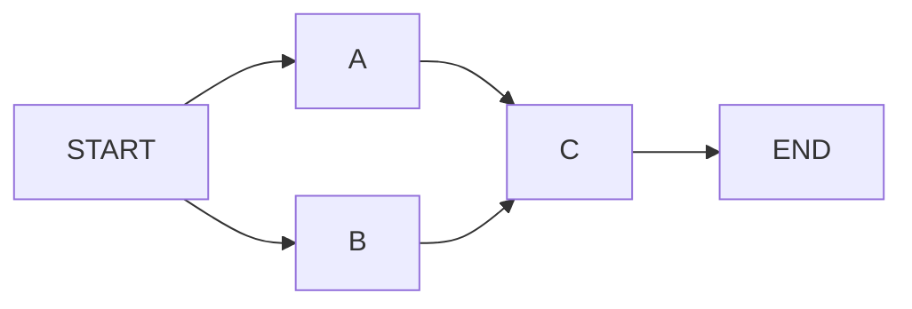

# Disruptor.go V1.1 Topology Graph Design

Status: specified.

This document captures the V1.1 design for named consumer dependency graphs.
The feature adds pipeline, join, and diamond topologies while preserving the V1
producer publication path. The document defines the topology graph portion of
V1.1.

## Objectives

- `RingBuffer`, `Sequencer`, publish, and backpressure hot paths remain
  unchanged.
- Add an explicit graph object for consumer dependency topology.
- Support pipeline, fan-in, fan-out, and diamond topologies such as `(A+B)+C`.
- Require explicit graph and node names for debugging, metrics, and graph export.
- V1 fan-out APIs retain existing behavior.
- Provide structured graph validation and readable error messages.
- Add node context to consumer requests, exceptions, and consumer metrics.
- Export graph structure as Mermaid, DOT, and structured snapshots.
- Cover the topology implementation with tests, examples, and benchmarks.

## Out Of Scope

- Topic routing or RabbitMQ-style `*` / `#` matching.
- `Handle(...).Then(...)` chain DSL.
- Runtime graph mutation after graph registration.
- Mixing V1 fan-out registration and V1.1 graph registration on one
  `Disruptor` instance.
- Externally implemented graph sources for `HandleGraph` in V1.1.
- Graph-level lifecycle hooks such as `OnGraphStart`.
- Pull-style `Poller[T]`.
- Batch rewind.
- SIMD or AVX scanner implementation.
- Prometheus or OpenTelemetry adapter package.
- Public custom sequencer extension.

## Public API

The graph is the primary topology abstraction. Nodes are named processors. Edges
describe sequence dependencies between nodes.

```go
graph, err := graph.New[OrderEvent]("order-pipeline")
if err != nil {
    return err
}

if err := graph.Node("validate", validateHandler); err != nil {
    return err
}
if err := graph.Node("enrich", enrichHandler); err != nil {
    return err
}
if err := graph.Node("persist", persistHandler); err != nil {
    return err
}
if err := graph.Edge("validate", "persist"); err != nil {
    return err
}
if err := graph.Edge("enrich", "persist"); err != nil {
    return err
}

graphProcessors, err := d.HandleGraph(graph)
if err != nil {
    return err
}
```

Static examples and tests can use `Must*` helpers:

```go
graph := graph.Must[OrderEvent]("order-pipeline").
    MustNode("validate", validateHandler).
    MustNode("enrich", enrichHandler).
    MustNode("persist", persistHandler)

graph.Join("validate", "enrich").MustTo("persist")

graphProcessors, err := d.HandleGraph(graph)
if err != nil {
    return err
}
```

The V1.1 API surface uses `*graph.Graph[T]` as the concrete graph builder and
registration object.

```go
const StartNode = "START"
const EndNode = "END"

func New[T any](name string) (*Graph[T], error)
func Must[T any](name string) *Graph[T]

func (g *Graph[T]) Name() string
func (g *Graph[T]) Node(
    name string,
    handler event.Handler[T],
    opts ...NodeOption[T],
) error
func (g *Graph[T]) MustNode(
    name string,
    handler event.Handler[T],
    opts ...NodeOption[T],
) *Graph[T]
func (g *Graph[T]) Edge(from string, to string) error
func (g *Graph[T]) MustEdge(from string, to string) *Graph[T]
func (g *Graph[T]) Join(sources ...string) JoinBuilder[T]
func (g *Graph[T]) Validate() error
func (g *Graph[T]) Snapshot() Snapshot
func (g *Graph[T]) Mermaid() string
func (g *Graph[T]) DOT() string

type JoinBuilder[T any] interface {
    To(targets ...string) error
    MustTo(targets ...string) *Graph[T]
}

func (d *disruptor.Disruptor[T]) HandleGraph(
    graph *graph.Graph[T],
    opts ...GraphOption[T],
) (GraphProcessors, error)
```

`graph.StartNode` and `graph.EndNode` are reserved virtual topology nodes used
by snapshot and export output. They are not valid real handler node names.

`Join` is syntax sugar over edges:

```go
graph.Join("A", "B").To("C", "D")
```

This expands to:

```text
A -> C
A -> D
B -> C
B -> D
```

`Join` does not add a separate runtime join counter. Fan-in behavior comes from
the downstream barrier depending on all upstream sequences.

The scheduler consumes a built `*graph.Graph[T]` from `pkg/graph`. Public
inspection goes through `Snapshot()`, `Mermaid()`, and `DOT()`, none of which
expose handler values.

## Node Options

Node-level configuration is required in V1.1 so complex graphs can tune
exception handling and observability per node.

```go
type NodeOption[T any] func(config *nodeConfig[T]) error

func WithNodeExceptionHandler[T any](
    handler ExceptionHandler[T],
) NodeOption[T]

func WithNodeLabel[T any](label string) NodeOption[T]

func WithNodeMetadata[T any](
    key string,
    value string,
) NodeOption[T]
```

Node configuration is internal:

```go
type nodeConfig[T any] struct {
    exceptionHandler ExceptionHandler[T]
    label            string
    metadata         map[string]string
}
```

Rules:

- Node name is the stable identity used by edges, errors, metrics, and lookup.
- Node label is a display name used by Mermaid, DOT, and debug output.
- Metadata is for observability and export only. It does not affect scheduling.
- Metadata keys and values must be non-empty.
- Node metadata is copied when exposed through snapshots.
- Node-level exception handlers override graph-level handlers.

Graph registration can provide graph-level processor defaults:

```go
type GraphOption[T any] func(options *graphOptions[T]) error

func WithGraphExceptionHandler[T any](
    handler ExceptionHandler[T],
) GraphOption[T]
```

Exception handler precedence is:

```text
node option > graph option > default processor config
```

Nil node exception handlers mean "inherit from graph options or the
default processor config".

## Scheduling Semantics

Each graph node becomes one `BatchEventProcessor`. The scheduler builds
processors before `Start`, wires each processor's barrier, and then gets out of
the event hot path.

For source nodes:

```text
barrier = ring cursor
```

For downstream nodes:

```text
barrier = min(ring cursor, upstream sequences...)
```

For producer backpressure:

```text
producer gating sequences = leaf node sequences only
```

Example `(A+B)+C`:

```text
A barrier = cursor
B barrier = cursor
C barrier = min(cursor, A.sequence, B.sequence)

producer gating = C.sequence
```

This keeps the producer flow unchanged:

```text
producer -> ring buffer -> sequencer -> publish
```

The topology layer only changes consumer barrier dependencies and final gating
sequence registration.

## Processor Construction And Gating

Public V1 processor construction keeps its current behavior:

```go
NewBatchEventProcessor(...)
```

This constructor registers the processor sequence as a producer gating sequence
and removes that gating sequence when the processor exits.

Graph mode uses an internal processor constructor or processor config that
preserves the public constructor behavior while allowing graph-specific wiring:

```text
producerGating = true only for leaf nodes
nodeContext    = graph/node identity
haltAdvances   = false in graph mode
```

Graph registration algorithm:

1. Reject nil graph.
2. Reject calls after `Disruptor.Start()` with `ErrClosed`.
3. Reject fan-out/graph mode mixing with `ErrConsumerModeConflict`.
4. Validate the graph.
5. Compute deterministic topological order, source nodes, and leaf nodes.
6. Create a processor for every node.
7. Source node barriers depend only on the ring cursor.
8. Downstream node barriers depend on the ring cursor and all upstream
   processor sequences.
9. Enable producer gating only on leaf node processors.
10. Freeze and mark the graph as handled.
11. Append processors to the owning `Disruptor`.

Intermediate node sequences remain barrier dependencies for downstream nodes,
while producer gating uses only leaf sequences. In `A -> B -> C`, C is the
topology leaf and the only producer-gating processor.

## Graph Validation

`Validate()` returns detailed errors and does not freeze the graph.
`HandleGraph()` calls `Validate()` before processor construction.

Validation rules:

- Graph name must be non-empty.
- Node name must be non-empty.
- Graph and node names are trimmed before storage.
- Trimmed names must not contain ASCII control characters.
- Node name must be unique within the graph.
- Handler must be non-nil.
- Edge `from` and `to` nodes must exist.
- Self-edges are rejected.
- Duplicate edges are idempotent and stored once.
- The graph must contain at least one node.
- The graph must be a DAG.
- Multiple source nodes are allowed.
- Multiple leaf nodes are allowed.
- A single-node graph is allowed.
- In a multi-node graph, a node with no incoming and no outgoing edge is
  rejected as isolated.
- Disconnected non-isolated components are allowed. For example, `A -> B` and
  `C -> D` in the same graph has two sources and two leaves.

Errors wrap sentinel values and include graph and node or edge details:

```go
var (
    graph.ErrInvalid
    graph.ErrFrozen
    graph.ErrHandled
    ErrConsumerModeConflict = errors.New("disruptor: consumer mode conflict")
)
```

Example messages:

```text
disruptor: invalid graph: graph order-pipeline: node validate already exists
disruptor: invalid graph: graph order-pipeline: edge validate -> persist references unknown node persist
disruptor: invalid graph: graph order-pipeline: cycle detected: A -> B -> C -> A
disruptor: invalid graph: graph order-pipeline: node audit is isolated
```

## Freeze And Lifecycle

Graph lifecycle:

```text
graph.New -> Node/Edge/Join -> Validate -> HandleGraph -> Freeze -> Start
```

Rules:

- `Validate()` checks structure and can be called repeatedly.
- `Validate()` does not freeze the graph.
- `HandleGraph()` validates and freezes the graph.
- After freeze, `Node`, `Edge`, and `Join(...).To(...)` return `graph.ErrFrozen`.
- The same graph cannot be handled twice.
- `HandleGraph()` cannot be called after `Disruptor.Start`.
- `Mermaid()`, `DOT()`, and `Snapshot()` are read-only and remain valid after
  freeze.
- Graph processors are started, stopped, and waited through the owning
  `Disruptor`.
- Topology dependencies order event processing for each sequence. Handler
  `OnStart` and `OnShutdown` ordering is lifecycle-manager-defined.

One `Disruptor[T]` instance must use one consumer registration mode:

```text
fan-out mode: HandleEventsWith / HandleEventsWithOptions
graph mode:   HandleGraph
```

Mixing modes returns `ErrConsumerModeConflict`.

Error precedence:

- `HandleGraph(nil)` returns `graph.ErrInvalid`.
- `HandleGraph` after `Start` returns `ErrClosed`.
- Mode mixing returns `ErrConsumerModeConflict`.
- A second successful handle of the same graph returns `graph.ErrHandled`.

## GraphProcessors

`HandleGraph` returns a named processor view instead of a raw slice.

```go
type GraphProcessors interface {
    Names() []string
    Processors() []EventProcessor
    Processor(name string) (EventProcessor, bool)
    Sequence(name string) (*Sequence, bool)
    Snapshot() GraphSnapshot
}
```

Rules:

- `Names()` returns node names in stable sorted order.
- `Processors()` returns processors in stable node-name order.
- `Processor(name)` returns `(nil, false)` for an unknown node.
- `Sequence(name)` returns `(nil, false)` for an unknown node.
- `Snapshot()` returns the graph snapshot captured at handle time.
- `GraphProcessors` does not own lifecycle methods. `Disruptor` remains the
  lifecycle owner.

The implementation can store processors by name and keep a sorted name slice for
stable output.

## Node Context

V1.1 adds lightweight node context to consumer-side payloads.

```go
type Node struct {
    GraphName string
    NodeName  string
    NodeLabel string
}
```

`event.Request[T]` carries node context:

```go
type Request[T any] struct {
    Context    context.Context
    Event      *T
    Sequence   int64
    EndOfBatch bool
    Node       Node
    Runtime    runtimevars.ContextView
}
```

Rules:

- V1 fan-out processors set `Node` to the zero value.
- V1.1 graph processors set `Node` before invoking the handler.
- The complete graph object is not stored in `event.Request[T]`.
- Node metadata is not stored in `event.Request[T]`; it remains available through
  snapshots and graph export.
- User tests use named fields when constructing request payloads.
  `event.Request[T]` is primarily constructed by the library and may gain metadata
  fields across minor versions.

Node context also appears in consumer-side errors and metrics:

```go
type Exception[T any] struct {
    Context  context.Context
    Event    *T
    Sequence int64
    Err      error
    Node     Node
}

type LifecycleException struct {
    Context context.Context
    Err     error
    Node    Node
}

type BatchStartRequest struct {
    Context    context.Context
    BatchSize  int64
    QueueDepth int64
    Node       Node
}

type EventMetric struct {
    Sequence int64
    Duration time.Duration
    Err      error
    Node     Node
}

type BatchMetric struct {
    BatchSize  int64
    QueueDepth int64
    Node       Node
}

type ProcessorMetric struct {
    State string
    Err   error
    Node  Node
}
```

`PublishMetric` does not include node context because publishing happens before
consumer topology dispatch.

## Exception Handling

Each graph node keeps independent processor exception handling. Graph mode adds
one coordination rule: `ExceptionActionHalt` is graph-terminal.

Rules:

- A node using `ExceptionActionHalt` does not advance its sequence for the
  failed event.
- A node using `ExceptionActionHalt` records its terminal error and asks the
  owning graph processors to stop, alerting dependent barriers.
- Downstream nodes skip the failed sequence because the failed upstream sequence
  is dependency-incomplete.
- A source node using `ExceptionActionContinue` advances, allowing downstream
  nodes to continue.
- A source node using `ExceptionActionRetry` does not advance, so downstream
  nodes wait.
- Middle nodes follow the same rules for their descendants.
- A leaf node halt is graph-terminal. Its failed sequence is not advanced.
  During shutdown cleanup, processor-owned gating sequences are removed using
  the same cleanup rule as V1 processors.
- A leaf node continue lets producer backpressure advance.
- A leaf node retry keeps producer backpressure until the retry succeeds or the
  policy changes.
- `Disruptor.Wait()` continues to aggregate terminal processor errors.
- `event.Exception[T]` and `event.LifecycleException` include `event.Node`.
- V1 fan-out processors keep the existing behavior where `Halt` stores the
  failed sequence before exit. The graph-specific halt rule is internal to
  `HandleGraph`.

Graph-level lifecycle hooks are not part of V1.1. Users can observe graph
startup and shutdown through node-level lifecycle handlers and processor metrics.

## Snapshot And Export

`Snapshot()` is the structured source for tests and tools. Mermaid and DOT are
human-facing projections built from the snapshot.

```go
type GraphSnapshot struct {
    Name    string
    Frozen  bool
    Nodes   []GraphNodeSnapshot
    Edges   []GraphEdgeSnapshot
    Sources []string
    Leaves  []string
}

type GraphNodeSnapshot struct {
    Name     string
    Label    string
    Metadata map[string]string
}

type GraphEdgeSnapshot struct {
    From string
    To   string
}
```

Rules:

- `Snapshot()` works before and after freeze.
- `Snapshot()` returns the structure currently built, even if validation fails.
- `graph.StartNode` is the reserved virtual entry node with value `START`.
- `graph.EndNode` is the reserved virtual exit node with value `END`.
- `Nodes` and `Edges` include virtual `START` and `END` terminals.
- Virtual entries are identified by the reserved `graph.StartNode` and
  `graph.EndNode` names.
- `Sources` and `Leaves` list real handler nodes only.
- Real nodes, real edges, sources, and leaves use stable sorting.
- Metadata maps are copied.
- `Mermaid()` and `DOT()` use the same snapshot ordering.
- Export functions must not include handler values.
- Export functions work for invalid or unvalidated graphs and render the current
  structure.
- Mermaid and DOT use generated stable node IDs (`n0`, `n1`, ...) and escaped
  labels. Graph and node names are labels, not raw syntax identifiers.
- Label escaping must cover quotes, backslashes, brackets, and newlines.

Example Mermaid for `(A+B)+C`:



## Package Layout

V1.1 places graph code in the public package:

```text
pkg/disruptor/
  graph.go
  graph_join.go
  graph_processors.go
  graph_snapshot.go
  node_context.go
```

Algorithm-only helpers may move to an internal package when validation and
export logic require extraction:

```text
internal/topology/
  validate.go
  sort.go
  export.go
```

Public types remain in `pkg/disruptor` even if internal helpers are extracted.

## Examples

V1.1 includes runnable examples:

- `examples/pipeline`: `validate -> enrich -> persist`
- `examples/diamond`: `A -> B`, `A -> C`, `B+C -> D`
- `examples/graph_export`: print Mermaid or snapshot output

Example tests verify output and use named handlers in public examples.

The diamond example must include a full lifecycle:

```go
graph := graph.Must[OrderEvent]("diamond").
    MustNode("A", handlerA).
    MustNode("B", handlerB).
    MustNode("C", handlerC).
    MustNode("D", handlerD)

graph.MustEdge("A", "B").
    MustEdge("A", "C")
graph.Join("B", "C").MustTo("D")

graphProcessors, err := d.HandleGraph(graph)
if err != nil {
    return err
}
if err := d.Start(ctx); err != nil {
    return err
}
defer d.Stop()
```

The example publishes one event and verifies that D observes the event only
after B and C have both processed it.

## Tests

Topology behavior is specified through tests.

Required coverage:

- `graph.New` rejects empty names.
- `graph.New` trims names and rejects control characters.
- `graph.Must` panics on invalid names.
- `Node` rejects empty names, duplicates, and nil handlers.
- `Node` trims names and rejects control characters.
- `Edge` rejects unknown nodes and self-edges.
- Duplicate edges are idempotent.
- `Join(...).To(...)` expands all source-target edge combinations.
- `Join` rejects empty sources or targets when `To` is called.
- `Validate` rejects cycles and reports the cycle path.
- `Validate` rejects isolated nodes in multi-node graphs.
- Single-node graphs validate.
- Multiple source and multiple leaf graphs validate.
- Source and leaf calculation is deterministic.
- `Snapshot` returns stable sorting and metadata copies.
- `Mermaid` and `DOT` are deterministic.
- `Mermaid` and `DOT` escape labels and use generated node IDs.
- `HandleGraph` freezes the graph.
- Mutating a frozen graph returns `graph.ErrFrozen`.
- Handling a graph twice returns `graph.ErrHandled`.
- Mixing `HandleEventsWith` and `HandleGraph` returns
  `ErrConsumerModeConflict`.
- `HandleGraph` cannot run after `Start`.
- `(A+B)+C` waits for both A and B before C handles a sequence.
- Leaf sequences are the only producer gating sequences.
- Intermediate graph node sequences are barrier dependencies only.
- `ExceptionActionHalt` in graph mode stops the graph without advancing the
  failed sequence.
- V1 `processor.NewBatchEventProcessor` still gates producers and still advances the
  failed sequence on halt.
- Node-level exception handler overrides graph-level exception handler.
- Graph-level exception handler overrides the default processor handler.
- `event.Request.Node` is populated for graph processors.
- Consumer metrics and exceptions include `event.Node`.
- `GraphProcessors` lookup methods behave for known and unknown node names.
- `HandleGraph(nil)` returns `graph.ErrInvalid`.
- `HandleGraph` after `Start` returns `ErrClosed`.
- `GraphProcessors.Snapshot()` returns defensive copies.
- Processor shutdown paths remain leak-free.

## Benchmarks

V1.1 must measure topology overhead explicitly:

- V1 fan-out baseline: `1p/1c`, `1p/4c`, `mp/4c`.
- Graph source-only equivalent to fan-out.
- Pipeline graph: `A -> B -> C`.
- Fan-in graph: `(A+B)+C`.
- Diamond graph: `A -> B`, `A -> C`, `B+C -> D`.
- Blocking and busy-spin wait strategies where relevant.
- Allocation count for graph handler dispatch.

Benchmark docs must explain that graph topology is for dependency ordering, not
topic routing or ownership transfer.

## Migration Notes

- Existing V1 `HandleEventsWith` and `HandleEventsWithOptions` behavior remains
  unchanged.
- Existing producers and translators remain unchanged.
- Existing V1 consumers see zero-value `event.Request.Node`.
- New graph users must build topology before `Start`.
- A single `Disruptor` instance cannot mix fan-out and graph modes.
- V1.1 adds `event.Node` fields to exported consumer-side payload structs:
  `event.Request`, `event.Exception`, `event.LifecycleException`, `event.BatchStartRequest`,
  `BatchMetric`, `EventMetric`, and `ProcessorMetric`.
- This is a source compatibility risk for external code using unkeyed composite
  literals. The project accepts this V1.1 risk because these structs are
  library-constructed callback payloads; user tests use named fields.
- Graph topology orders consumers over the same ring event. It does not route,
  clone, transform, or transfer event ownership.

## Extension Backlog

The following items are outside this topology graph design:

- Topic routing with dotted event keys and RabbitMQ-style `*` / `#` patterns.
- `Handle(...).Then(...)` chain DSL.
- Pull-style `Poller[T]`.
- Timeout-aware wait strategies and `TimeoutHandler`.
- Full batch rewind.
- SIMD or AVX availability scanner backend.
- Prometheus and OpenTelemetry adapters.
- Public custom sequencer extension.
- Runtime graph mutation.

## Decision Status

The V1.1 topology graph design has no unresolved product-level decisions.
Implementation-level details include unexported struct names, traversal helper
function names, and error message punctuation.
