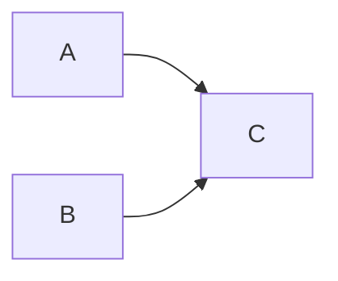

# Disruptor.go V1.1 Topology Graph Design

Status: awaiting user review before implementation planning.

This document captures the V1.1 design for named consumer dependency graphs.
The feature adds pipeline, join, and diamond topologies without changing the V1
producer publication path. It defines the topology graph portion of V1.1, not
every item in the broader V2 backlog.

## Goals

- Keep `RingBuffer`, `Sequencer`, publish, and backpressure hot paths unchanged.
- Add an explicit graph object for consumer dependency topology.
- Support pipeline, fan-in, fan-out, and diamond topologies such as `(A+B)+C`.
- Require explicit graph and node names for debugging, metrics, and graph export.
- Keep V1 fan-out APIs working as they do today.
- Provide structured graph validation and readable error messages.
- Add node context to consumer requests, exceptions, and consumer metrics.
- Export graph structure as Mermaid, DOT, and structured snapshots.
- Cover the topology implementation with tests, examples, and benchmarks.

## Non-Goals

- No topic routing or RabbitMQ-style `*` / `#` matching in this topology
  design.
- No `Handle(...).Then(...)` chain DSL in this topology design.
- No runtime graph mutation after the graph is handled.
- No mixing V1 fan-out registration and V1.1 graph registration on one
  `Disruptor` instance.
- No graph-level lifecycle hooks such as `OnGraphStart`.
- No pull-style `Poller[T]`.
- No batch rewind implementation.
- No SIMD or AVX scanner implementation.
- No Prometheus or OpenTelemetry adapter package.
- No public custom sequencer extension.

Deferred items remain candidates for later minor versions.

## Public API

The graph is the primary topology abstraction. Nodes are named processors. Edges
describe sequence dependencies between nodes.

```go
graph, err := disruptor.NewGraph[OrderEvent]("order-pipeline")
if err != nil {
    return err
}

if err := graph.Node("validate", validateHandler); err != nil {
    return err
}
if err := graph.Node("enrich", enrichHandler); err != nil {
    return err
}
if err := graph.Node("persist", persistHandler); err != nil {
    return err
}
if err := graph.Edge("validate", "persist"); err != nil {
    return err
}
if err := graph.Edge("enrich", "persist"); err != nil {
    return err
}

graphProcessors, err := d.HandleGraph(graph)
if err != nil {
    return err
}
```

Static examples and tests can use `Must*` helpers:

```go
graph := disruptor.MustGraph[OrderEvent]("order-pipeline").
    MustNode("validate", validateHandler).
    MustNode("enrich", enrichHandler).
    MustNode("persist", persistHandler)

graph.Join("validate", "enrich").MustTo("persist")

graphProcessors, err := d.HandleGraph(graph)
if err != nil {
    return err
}
```

The first V1.1 API surface separates the mutable builder from the read-only
graph interface accepted by `HandleGraph`.

```go
func NewGraph[T any](name string) (*Graph[T], error)
func MustGraph[T any](name string) *Graph[T]

func (g *Graph[T]) Name() string
func (g *Graph[T]) Node(
    name string,
    handler EventHandler[T],
    opts ...NodeOption[T],
) error
func (g *Graph[T]) MustNode(
    name string,
    handler EventHandler[T],
    opts ...NodeOption[T],
) *Graph[T]
func (g *Graph[T]) Edge(from string, to string) error
func (g *Graph[T]) MustEdge(from string, to string) *Graph[T]
func (g *Graph[T]) Join(sources ...string) JoinBuilder[T]
func (g *Graph[T]) Validate() error
func (g *Graph[T]) Definition() GraphDefinition[T]
func (g *Graph[T]) Snapshot() GraphSnapshot
func (g *Graph[T]) Mermaid() string
func (g *Graph[T]) DOT() string

type JoinBuilder[T any] interface {
    To(targets ...string) error
    MustTo(targets ...string) *Graph[T]
}

type EventGraph[T any] interface {
    Name() string
    Validate() error
    Definition() GraphDefinition[T]
    Snapshot() GraphSnapshot
    Mermaid() string
    DOT() string
}

func (d *Disruptor[T]) HandleGraph(
    graph EventGraph[T],
    opts ...GraphHandleOption[T],
) (GraphProcessors, error)
```

`Join` is syntax sugar over edges:

```go
graph.Join("A", "B").To("C", "D")
```

This expands to:

```text
A -> C
A -> D
B -> C
B -> D
```

`Join` does not add a separate runtime join counter. Fan-in behavior comes from
the downstream barrier depending on all upstream sequences.

`GraphDefinition` is the scheduler-facing representation. It includes handlers
and node configuration, while `GraphSnapshot` deliberately omits handler values.

```go
type GraphDefinition[T any] struct {
    Name  string
    Nodes []GraphNodeDefinition[T]
    Edges []GraphEdgeSnapshot
}

type GraphNodeDefinition[T any] struct {
    Name             string
    Handler          EventHandler[T]
    ExceptionHandler ExceptionHandler[T]
    Label            string
    Metadata         map[string]string
}
```

`Definition()` returns defensive copies of slices and maps. Handler and
exception handler interface values are copied by value.

## Node Options

Node-level configuration is required in V1.1 so complex graphs can tune
exception handling and observability per node.

```go
type NodeOption[T any] interface {
    applyNode(config *NodeConfig[T]) error
}

func WithNodeExceptionHandler[T any](
    handler ExceptionHandler[T],
) NodeOption[T]

func WithNodeLabel[T any](label string) NodeOption[T]

func WithNodeMetadata[T any](
    key string,
    value string,
) NodeOption[T]
```

`NodeConfig` is internal or read-only public API:

```go
type NodeConfig[T any] struct {
    ExceptionHandler ExceptionHandler[T]
    Label            string
    Metadata         map[string]string
}
```

Rules:

- Node name is the stable identity used by edges, errors, metrics, and lookup.
- Node label is a display name used by Mermaid, DOT, and debug output.
- Metadata is for observability and export only. It does not affect scheduling.
- Metadata keys and values must be non-empty.
- Node metadata is copied when exposed through snapshots.
- Node-level exception handlers override graph-level handlers.

Graph registration can provide graph-level processor defaults:

```go
type GraphHandleOption[T any] interface {
    applyGraphHandle(config *GraphHandleConfig[T]) error
}

func WithGraphExceptionHandler[T any](
    handler ExceptionHandler[T],
) GraphHandleOption[T]
```

Exception handler precedence is:

```text
node option > graph handle option > default processor config
```

## Scheduling Semantics

Each graph node becomes one `BatchEventProcessor`. The scheduler builds
processors before `Start`, wires each processor's barrier, and then gets out of
the event hot path.

For source nodes:

```text
barrier = ring cursor
```

For downstream nodes:

```text
barrier = min(ring cursor, upstream sequences...)
```

For producer backpressure:

```text
producer gating sequences = leaf node sequences only
```

Example `(A+B)+C`:

```text
A barrier = cursor
B barrier = cursor
C barrier = min(cursor, A.sequence, B.sequence)

producer gating = C.sequence
```

This keeps the producer flow unchanged:

```text
producer -> ring buffer -> sequencer -> publish
```

The topology layer only changes consumer barrier dependencies and final gating
sequence registration.

## Graph Validation

`Validate()` returns detailed errors and does not freeze the graph.
`HandleGraph()` calls `Validate()` before processor construction.

Validation rules:

- Graph name must be non-empty.
- Node name must be non-empty.
- Node name must be unique within the graph.
- Handler must be non-nil.
- Edge `from` and `to` nodes must exist.
- Self-edges are rejected.
- Duplicate edges are idempotent and stored once.
- The graph must contain at least one node.
- The graph must be a DAG.
- Multiple source nodes are allowed.
- Multiple leaf nodes are allowed.
- A single-node graph is allowed.
- In a multi-node graph, a node with no incoming and no outgoing edge is
  rejected as isolated.

Errors should wrap sentinel values and include graph and node or edge details:

```go
var (
    ErrInvalidGraph         = errors.New("disruptor: invalid graph")
    ErrGraphFrozen          = errors.New("disruptor: graph is frozen")
    ErrGraphHandled         = errors.New("disruptor: graph already handled")
    ErrConsumerModeConflict = errors.New("disruptor: consumer mode conflict")
)
```

Example messages:

```text
disruptor: invalid graph: graph order-pipeline: node validate already exists
disruptor: invalid graph: graph order-pipeline: edge validate -> persist references unknown node persist
disruptor: invalid graph: graph order-pipeline: cycle detected: A -> B -> C -> A
disruptor: invalid graph: graph order-pipeline: node audit is isolated
```

## Freeze And Lifecycle

Graph lifecycle:

```text
NewGraph -> Node/Edge/Join -> Validate -> HandleGraph -> Freeze -> Start
```

Rules:

- `Validate()` checks structure and can be called repeatedly.
- `Validate()` does not freeze the graph.
- `HandleGraph()` validates and freezes the graph.
- After freeze, `Node`, `Edge`, and `Join(...).To(...)` return
  `ErrGraphFrozen`.
- The same graph cannot be handled twice.
- `HandleGraph()` cannot be called after `Disruptor.Start`.
- `Mermaid()`, `DOT()`, and `Snapshot()` are read-only and remain valid after
  freeze.
- Graph processors are started, stopped, and waited through the owning
  `Disruptor`.

One `Disruptor[T]` instance must use one consumer registration mode:

```text
fan-out mode: HandleEventsWith / HandleEventsWithOptions
graph mode:   HandleGraph
```

Mixing modes returns `ErrConsumerModeConflict`.

## GraphProcessors

`HandleGraph` returns a named processor view instead of a raw slice.

```go
type GraphProcessors interface {
    Names() []string
    Processors() []EventProcessor
    Processor(name string) (EventProcessor, bool)
    Sequence(name string) (*Sequence, bool)
    Snapshot() GraphSnapshot
}
```

Rules:

- `Names()` returns node names in stable sorted order.
- `Processors()` returns processors in stable node-name order.
- `Processor(name)` returns `(nil, false)` for an unknown node.
- `Sequence(name)` returns `(nil, false)` for an unknown node.
- `Snapshot()` returns the graph snapshot captured at handle time.
- `GraphProcessors` does not own lifecycle methods. `Disruptor` remains the
  lifecycle owner.

The implementation can store processors by name and keep a sorted name slice for
stable output.

## Node Context

V1.1 adds lightweight node context to consumer-side payloads.

```go
type NodeContext struct {
    GraphName string
    NodeName  string
    NodeLabel string
}
```

`EventRequest` gains a `Node` field:

```go
type EventRequest[T any] struct {
    Context    context.Context
    Event      *T
    Sequence   int64
    EndOfBatch bool
    Node       NodeContext
}
```

Rules:

- V1 fan-out processors set `Node` to the zero value.
- V1.1 graph processors set `Node` before invoking the handler.
- The complete graph object is not stored in `EventRequest`.
- Node metadata is not stored in `EventRequest`; it remains available through
  snapshots and graph export.
- User tests should prefer named fields when constructing request payloads.
  `EventRequest` is primarily constructed by the library and may gain metadata
  fields across minor versions.

Node context also appears in consumer-side errors and metrics:

```go
type EventException[T any] struct {
    Context  context.Context
    Event    *T
    Sequence int64
    Err      error
    Node     NodeContext
}

type LifecycleException struct {
    Context context.Context
    Err     error
    Node    NodeContext
}

type BatchStartRequest struct {
    Context    context.Context
    BatchSize  int64
    QueueDepth int64
    Node       NodeContext
}

type EventMetric struct {
    Sequence int64
    Duration time.Duration
    Err      error
    Node     NodeContext
}

type BatchMetric struct {
    BatchSize  int64
    QueueDepth int64
    Node       NodeContext
}

type ProcessorMetric struct {
    State string
    Err   error
    Node  NodeContext
}
```

`PublishMetric` does not include node context because publishing happens before
consumer topology dispatch.

## Exception Handling

Each graph node keeps independent processor exception handling. The graph does
not swallow errors or create graph-level exception magic.

Rules:

- A source node using `ExceptionActionHalt` stops and blocks its downstream
  nodes at the failed sequence.
- A source node using `ExceptionActionContinue` advances, allowing downstream
  nodes to continue.
- A source node using `ExceptionActionRetry` does not advance, so downstream
  nodes wait.
- Middle nodes follow the same rules for their descendants.
- A leaf node halt leaves the producer gated by that leaf sequence.
- A leaf node continue lets producer backpressure advance.
- A leaf node retry keeps producer backpressure until the retry succeeds or the
  policy changes.
- `Disruptor.Wait()` continues to aggregate terminal processor errors.
- `EventException` and `LifecycleException` include `NodeContext`.

Graph-level lifecycle hooks are not part of V1.1. Users can observe graph
startup and shutdown through node-level lifecycle handlers and processor metrics.

## Snapshot And Export

`Snapshot()` is the structured source for tests and tools. Mermaid and DOT are
human-facing projections built from the snapshot.

```go
type GraphSnapshot struct {
    Name    string
    Frozen  bool
    Nodes   []GraphNodeSnapshot
    Edges   []GraphEdgeSnapshot
    Sources []string
    Leaves  []string
}

type GraphNodeSnapshot struct {
    Name     string
    Label    string
    Metadata map[string]string
}

type GraphEdgeSnapshot struct {
    From string
    To   string
}
```

Rules:

- `Snapshot()` works before and after freeze.
- `Snapshot()` returns the structure currently built, even if validation fails.
- Nodes, edges, sources, and leaves use stable sorting.
- Metadata maps are copied.
- `Mermaid()` and `DOT()` use the same snapshot ordering.
- Export functions must not include handler values.

Example Mermaid for `(A+B)+C`:



## Package Layout

V1.1 keeps graph code in the public package first:

```text
pkg/disruptor/
  graph.go
  graph_join.go
  graph_processors.go
  graph_snapshot.go
  node_context.go
```

This avoids premature internal package splitting while the public API settles.
If graph validation and export logic grows, pure algorithm code can move later:

```text
internal/topology/
  validate.go
  sort.go
  export.go
```

Public types remain in `pkg/disruptor` even if internal helpers are extracted.

## Examples

V1.1 should add runnable examples:

- `examples/pipeline`: `validate -> enrich -> persist`
- `examples/diamond`: `A -> B`, `A -> C`, `B+C -> D`
- `examples/graph_export`: print Mermaid or snapshot output

Example tests should verify output and avoid anonymous function-heavy public
examples. Named handlers remain the preferred demonstration style.

## Tests

Topology work must follow test-first development.

Required coverage:

- `NewGraph` rejects empty names.
- `MustGraph` panics on invalid names.
- `Node` rejects empty names, duplicates, and nil handlers.
- `Edge` rejects unknown nodes and self-edges.
- Duplicate edges are idempotent.
- `Join(...).To(...)` expands all source-target edge combinations.
- `Join` rejects empty sources or targets when `To` is called.
- `Validate` rejects cycles and reports the cycle path.
- `Validate` rejects isolated nodes in multi-node graphs.
- Single-node graphs validate.
- Multiple source and multiple leaf graphs validate.
- Source and leaf calculation is deterministic.
- `Snapshot` returns stable sorting and metadata copies.
- `Mermaid` and `DOT` are deterministic.
- `HandleGraph` freezes the graph.
- Mutating a frozen graph returns `ErrGraphFrozen`.
- Handling a graph twice returns `ErrGraphHandled`.
- Mixing `HandleEventsWith` and `HandleGraph` returns
  `ErrConsumerModeConflict`.
- `HandleGraph` cannot run after `Start`.
- `(A+B)+C` waits for both A and B before C handles a sequence.
- Leaf sequences are the only producer gating sequences.
- Node-level exception handler overrides graph-level exception handler.
- Graph-level exception handler overrides the default processor handler.
- `EventRequest.Node` is populated for graph processors.
- Consumer metrics and exceptions include `NodeContext`.
- `GraphProcessors` lookup methods behave for known and unknown node names.
- Processor shutdown paths remain leak-free.

## Benchmarks

V1.1 must measure topology overhead explicitly:

- V1 fan-out baseline: `1p/1c`, `1p/4c`, `mp/4c`.
- Graph source-only equivalent to fan-out.
- Pipeline graph: `A -> B -> C`.
- Fan-in graph: `(A+B)+C`.
- Diamond graph: `A -> B`, `A -> C`, `B+C -> D`.
- Blocking and busy-spin wait strategies where relevant.
- Allocation count for graph handler dispatch.

Benchmark docs must explain that graph topology is for dependency ordering, not
topic routing or ownership transfer.

## Migration Notes

- Existing V1 `HandleEventsWith` and `HandleEventsWithOptions` behavior remains
  unchanged.
- Existing producers and translators do not change.
- Existing V1 consumers see zero-value `EventRequest.Node`.
- New graph users must build topology before `Start`.
- A single `Disruptor` instance cannot mix fan-out and graph modes.
- Users that manually construct `EventRequest` in tests should use named fields.

## Deferred Backlog

The following items remain outside this topology graph design:

- Topic routing with dotted event keys and RabbitMQ-style `*` / `#` patterns.
- `Handle(...).Then(...)` chain DSL.
- Pull-style `Poller[T]`.
- Timeout-aware wait strategies and `TimeoutHandler`; these remain separate
  design work if they are selected for the next minor release.
- Full batch rewind.
- SIMD or AVX availability scanner backend.
- Prometheus and OpenTelemetry adapters.
- Public custom sequencer extension.
- Runtime graph mutation.

## Open Decisions

There are no open decisions for this V1.1 topology graph design. Implementation
details such as exact unexported struct names, traversal helper function names,
and error message punctuation can be settled during the implementation plan.
