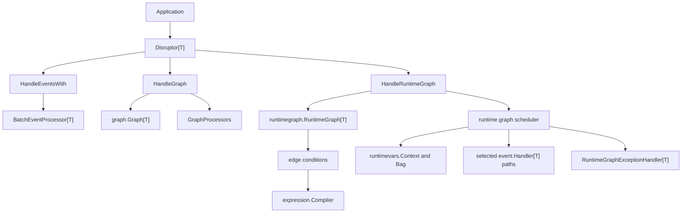
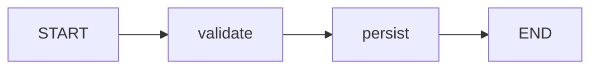
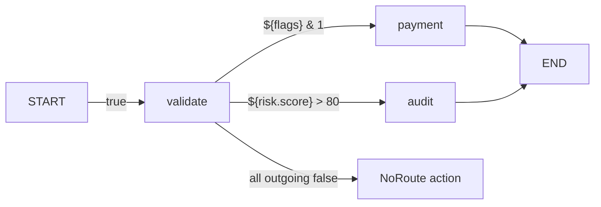

# Disruptor.go V1.2 Runtime Graph Design

## Status

Implemented and under release review.

Target tag: `v1.2.0`

This design extends V1.1 graph support in two phases:

1. Tighten `Graph[T]` terminal-node semantics so graph entry and exit edges are
   explicit.
2. Add `RuntimeGraph[T]` for event-level conditional routing.

## Goals

- Keep the V1.1 static `Graph[T]` processing path high-performance and
  deterministic.
- Make `START` and `END` built-in graph nodes while requiring developers to
  maintain terminal edges explicitly.
- Add `RuntimeGraph[T]` as a separate API for conditional runtime routing.
- Support edge conditions through both typed Go predicates and a built-in
  expression engine.
- Support runtime-generated variables, similar to BPMN process variables.
- Keep public APIs interface-first and replaceable through options.
- Avoid anonymous function types in public function signatures. `XxxFunc`
  adapters may exist as named helper types.
- Add tests, examples, and benchmarks for both static graph migration and runtime
  graph behavior.

## Non-Goals

- Topic routing, wildcard matching, and trie-based dispatch remain outside
  V1.2.0.
- Runtime graph cycles and loops are not supported in V1.2.0.
- Graph topology mutation after registration or start is not supported.
- Static `Graph[T]` does not get conditional edges.
- The built-in expression engine does not execute user code.
- Arithmetic operators beyond the required comparison, logical, and bitwise
  operators are not required in V1.2.0.

## Design Summary

V1.2.0 standardizes graph terminal semantics:

- `graph.StartNode` and `graph.EndNode` are the exported constants for `START`
  and `END`.
- `START` and `END` are built-in virtual nodes.
- Developers do not register handlers for `START` or `END`.
- Developers must declare terminal edges explicitly.
- Snapshot and export output render built-in terminal nodes and explicit edges
  only.

`RuntimeGraph[T]` uses the same terminal-node model but adds runtime conditions
on edges. Each event starts at `START`, evaluates outgoing edge conditions, and
routes only through selected edges. Handlers for unselected paths do not run.



## Phase 1: Static Graph Terminal Edges

### Current V1.1 Behavior

V1.1 automatically augments snapshots with:

- `START -> source`
- `leaf -> END`

Those virtual edges are useful for visualization, but they can hide missing
developer intent. V1.2.0 removes this implicit edge completion.

### V1.2.0 Static Graph Rule

`START` and `END` are built-in nodes, but terminal edges must be explicit.



```go
graph := topology.Must[OrderEvent]("order").
    MustNode("validate", ValidateHandler{}).
    MustNode("persist", PersistHandler{}).
    MustEdge(topology.StartNode, "validate").
    MustEdge("validate", "persist").
    MustEdge("persist", topology.EndNode)
```

Allowed edges:

- `START -> real node`
- `real node -> real node`
- `real node -> END`

Rejected edges:

- `START -> END`
- `START -> START`
- `END -> END`
- `real node -> START`
- `END -> real node`
- `END -> START`
- terminal edges referencing missing real nodes

`Node("START", ...)` and `Node("END", ...)` remain invalid. Terminal nodes are
owned by the framework.

### Snapshot Shape

`GraphSnapshot` gains entry and exit lists:

```go
type GraphSnapshot struct {
    Name    string
    Frozen  bool
    Nodes   []GraphNodeSnapshot
    Edges   []GraphEdgeSnapshot
    Sources []string
    Leaves  []string
    Entries []string
    Exits   []string
}
```

Meaning:

- `Sources`: real nodes with no real upstream nodes.
- `Leaves`: real nodes with no real downstream nodes.
- `Entries`: real nodes targeted by explicit `START -> real` edges.
- `Exits`: real nodes with explicit `real -> END` edges.

`Nodes` includes `START` and `END` when the graph has at least one real node.
`Edges` includes only edges declared by the developer. No automatic terminal
edges are added.

Adding `Entries` and `Exits` changes the exported struct shape. Keyed composite
literals remain compatible. Unkeyed `GraphSnapshot` literals must be updated.

### Static Graph Validation

`Graph.Validate()` must enforce:

- At least one real node exists.
- There is at least one explicit entry edge.
- There is at least one explicit exit edge.
- `Entries` equals `Sources` as a set.
- `Exits` equals `Leaves` as a set.
- Every real node is reachable from `START`.
- Every real node can reach `END`.
- Real-node edges remain acyclic.
- Terminal nodes cannot be used as handlers.

Terminal edges are excluded from real source, leaf, and cycle computation.

### Static Graph Scheduling

`HandleGraph` ignores terminal nodes and terminal edges when wiring processors:

- No processor is created for `START`.
- No processor is created for `END`.
- `START -> real` does not create a barrier dependency.
- `real -> END` does not create a processor or sequence dependency.
- Real-node edges still define the static barrier graph.
- Producer gating still attaches to real leaves only.

This preserves the V1.1 hot path.

### Static Graph Migration

V1.1 code:

```go
graph := topology.Must[OrderEvent]("order").
    MustNode("validate", ValidateHandler{}).
    MustNode("persist", PersistHandler{}).
    MustEdge("validate", "persist")
```

V1.2.0 code:

```go
graph := topology.Must[OrderEvent]("order").
    MustNode("validate", ValidateHandler{}).
    MustNode("persist", PersistHandler{}).
    MustEdge(topology.StartNode, "validate").
    MustEdge("validate", "persist").
    MustEdge("persist", topology.EndNode)
```

Documentation and examples must call this out as a behavioral tightening in
`v1.2.0`.

## Phase 2: RuntimeGraph

### RuntimeGraph Purpose

`RuntimeGraph[T]` is a separate graph type for conditional event routing.

It is not a variant of `Graph[T]`. It has its own registration, scheduling, and
error handling because each event may activate a different path.

### Routing Semantics

Runtime graph edges are routing edges, not filters.

- An event starts from `START`.
- Each outgoing edge condition is evaluated for that event.
- If an edge condition is `true`, the downstream path is selected.
- If an edge condition is `false`, the downstream path is skipped.
- A skipped node does not execute its handler.
- `END` represents event completion in the runtime graph.

Terminal edges also support conditions:

- `START -> node` can have a condition.
- `node -> END` can have a condition.
- The default condition is `true`.



### RuntimeGraph API Sketch

```go
runtimeGraph := runtimegraph.MustRuntimeGraph[OrderEvent]("order").
    MustNode("validate", ValidateHandler{}).
    MustNode("payment", PaymentHandler{}).
    MustNode("audit", AuditHandler{}).
    MustEdge(topology.StartNode, "validate").
    MustEdge(
        "validate",
        "payment",
        runtimegraph.WhenExpression[OrderEvent](`${flags} & 1`),
    ).
    MustEdge(
        "validate",
        "audit",
        runtimegraph.WhenExpression[OrderEvent](`${risk.score} > 80`),
    ).
    MustEdge("payment", topology.EndNode).
    MustEdge("audit", topology.EndNode)

processors, err := d.HandleRuntimeGraph(
    runtimeGraph,
    disruptor.WithRuntimeGraphNoRouteAction[OrderEvent](
        disruptor.RuntimeNoRouteActionComplete,
    ),
)
```

Expected public constructors and registration methods:

```go
func runtimegraph.NewRuntimeGraph[T any](
    name string,
    opts ...RuntimeGraphOption,
) (*RuntimeGraph[T], error)
func runtimegraph.MustRuntimeGraph[T any](
    name string,
    opts ...RuntimeGraphOption,
) *RuntimeGraph[T]
func runtimegraph.WithExpressionCompiler(
    compiler expression.Compiler,
) RuntimeGraphOption

func (g *RuntimeGraph[T]) Name() string
func (g *RuntimeGraph[T]) Node(
    name string,
    handler EventHandler[T],
    opts ...RuntimeNodeOption[T],
) error
func (g *RuntimeGraph[T]) MustNode(
    name string,
    handler EventHandler[T],
    opts ...RuntimeNodeOption[T],
) *RuntimeGraph[T]
func (g *RuntimeGraph[T]) Edge(
    from string,
    to string,
    opts ...RuntimeEdgeOption[T],
) error
func (g *RuntimeGraph[T]) MustEdge(
    from string,
    to string,
    opts ...RuntimeEdgeOption[T],
) *RuntimeGraph[T]

func (d *Disruptor[T]) HandleRuntimeGraph(
    graph *RuntimeGraph[T],
    opts ...RuntimeGraphHandleOption[T],
) (RuntimeGraphProcessors, error)
```

Runtime graph node options may reuse existing node label and metadata behavior.
Runtime-specific error handling is defined separately below.

### RuntimeGraph Snapshot

Runtime graph snapshots should not expose handler values or compiled expression
internals.

```go
type RuntimeGraphSnapshot struct {
    Name    string
    Frozen  bool
    Nodes   []GraphNodeSnapshot
    Edges   []RuntimeGraphEdgeSnapshot
    Sources []string
    Leaves  []string
    Entries []string
    Exits   []string
}

type RuntimeGraphEdgeSnapshot struct {
    From      string
    To        string
    Condition string
}
```

`Condition` is a stable display string. Typed conditions that do not expose an
expression may render as an implementation name or `custom`.

## Edge Conditions

### Condition Interface

```go
type EdgeCondition[T any] interface {
    Evaluate(request EdgeConditionRequest[T]) (bool, error)
}

type EdgeConditionRequest[T any] struct {
    Context   context.Context
    Event     *T
    Sequence  int64
    GraphName string
    From      string
    To        string
    Runtime   runtimevars.ContextView
}
```

Named adapter types may be provided:

```go
type EdgeConditionFunc[T any] func(EdgeConditionRequest[T]) (bool, error)
```

No public API should accept an unnamed function type as a parameter.

### Edge Options

```go
func WhenCondition[T any](
    condition EdgeCondition[T],
) RuntimeEdgeOption[T]

func WhenExpression[T any](
    expression expression.Expression,
) RuntimeEdgeOption[T]
```

If no condition option is provided, the edge condition is `true`.

## Expression Engine

### Requirements

The built-in expression engine is required for V1.2.0.

- Expressions compile during graph validation or registration.
- Expression parse errors fail before the graph starts.
- Runtime evaluation uses compiled expressions, not raw string parsing.
- Every expression must produce a value that can become a boolean.
- Evaluation errors enter the runtime graph exception path.

### Expression Types

```go
type Expression string

type Compiler interface {
    Compile(expression Expression) (BoolExpression, error)
}

type BoolExpression interface {
    EvaluateBool(request Request) (bool, error)
}

type Request struct {
    Context   context.Context
    Variables runtimevars.Variables
}
```

The default compiler must be replaceable through `RuntimeGraph` options.

### Supported Syntax

Initial syntax:

- bool literals: `true`, `false`
- nil literal: `nil`
- string literals: `"paid"`
- integer literals: `123`, `0x10`, `0b1000`, `0o755`
- float literals for comparison: `12.34`
- paths: `${flags}`, `${risk.score}`, `${order.user.level}`
- comparisons: `==`, `!=`, `>`, `>=`, `<`, `<=`
- logical operators: `&&`, `||`, `!`
- grouping: `(...)`
- bitwise operators: `&`, `|`, `^`, `&^`, `<<`, `>>`

Path syntax uses dot-separated identifiers inside `${...}`. Empty path segments
are invalid.

### Numeric Semantics

The default numeric path is intentionally small and allocation-conscious:

- signed integer comparisons are exact.
- unsigned integer comparisons are exact.
- mixed signed/unsigned integer comparisons are exact and handle negative signed
  values without converting them to large unsigned values.
- float operands use Go `float64` comparison semantics.

Fixed-point decimal arithmetic is not part of the default compiler. Starting in
V1.3.0, decimal, money, big-number, and similar domain number semantics are
supplied through `expression.WithNumberAdapter(adapter)` so the default routing
hot path stays allocation-conscious.

### Boolean Conversion

The final expression result must convert to bool:

- `bool`: used directly.
- integer: `0` is `false`; non-zero is `true`.
- string: parsed with `strconv.ParseBool`.
- float: not converted to bool by default.
- nil: not converted to bool by default.
- object: not converted to bool by default.

Integer-to-bool conversion applies only to the final expression result.

This is valid:

```text
${flags} & 1
```

This is invalid because `&&` operands must already be bool:

```text
(${flags} & 1) && ${vip}
```

The intended form is:

```text
(${flags} & 1) != 0 && ${vip}
```

### Bitwise Rules

- Bitwise operands must be integers.
- Signed and unsigned integers are supported.
- Float values cannot participate in bitwise operations.
- Shift counts must be non-negative integers.
- Bitwise results are integers.
- A top-level bitwise result can become bool through final integer conversion.

Examples:

```text
${flags} & 1
(${flags} & 0x04) != 0
(${flags} & ${mask}) == ${mask}
```

## Runtime Variables

### RuntimeBag

Runtime variables are event-scoped and shared by handlers and expressions.

```go
type RuntimeVariables interface {
    Lookup(path string) (any, bool)
}

type RuntimeBag interface {
    RuntimeVariables
    Set(path string, value any) error
    Delete(path string) error
}
```

Rules:

- Each event has its own runtime bag.
- The bag is concurrency-safe.
- Handler code may write to the bag.
- Expressions read from the bag.
- If parallel branches write the same path, the later write wins.
- Paths are dot-separated. Empty path segments are invalid.

Example:

```go
func (h ValidateHandler) OnEvent(
    request event.Request[OrderEvent],
) error {
    request.Runtime.Set("validated", true)
    request.Runtime.Set("risk.score", 98)
    return nil
}
```

Expression:

```text
${validated} && ${risk.score} > 80
```

### Runtime Context on Requests

`event.Request[T]` includes runtime access for runtime graph handlers. The field
is zero-value safe for fan-out and static graph users.

```go
type Request[T any] struct {
    Context    context.Context
    Event      *T
    Sequence   int64
    EndOfBatch bool
    Node       event.Node
    Runtime    runtimevars.ContextView
}
```

`runtimevars.ContextView` exposes only stable read capabilities and
`runtimevars.Context` adds write support:

```go
type ContextView interface {
    Variables() Variables
    Get(path string) (any, bool)
}

type Context interface {
    ContextView
    Set(path string, value any) error
}
```

Handlers receive `runtimevars.ContextView` through `event.Request.Runtime`; the
framework provides a concrete runtime context for runtime graph execution so
handlers can call `request.Runtime.Set(...)` directly when the request is created
by the framework. `Variables()` returns the merged read-only view used by
expression evaluation.

For non-runtime graph processing, `Runtime` should be a no-op context when the
request is created by the framework. User-created zero-value requests may still
leave it nil.

### Resolver and Converter Pipeline

Expression evaluation uses two layers:

1. Resolver obtains raw values.
2. Converter normalizes raw values into expression values.

Lookup priority:

1. runtime bag
2. `runtimevars.Provider[T]`
3. `runtimevars.Resolver[T]`

```go
type Provider[T any] interface {
    Variables(request ProviderRequest[T]) (Variables, error)
}

type ProviderRequest[T any] struct {
    Context   context.Context
    Event     *T
    Sequence  int64
    GraphName string
}

type EventValueResolver[T any] interface {
    ResolveEventValue(
        request EventValueResolveRequest[T],
    ) (any, bool, error)
}
```

Default event resolution may use reflection. Hot deployments can replace it with
a typed resolver through options.

### Expression Values and Converters

The evaluator should know a small fixed set of internal kinds.

```go
type ExpressionValueKind uint8

const (
    ExpressionValueInvalid ExpressionValueKind = iota
    ExpressionValueBool
    ExpressionValueInt
    ExpressionValueUint
    ExpressionValueFloat
    ExpressionValueString
    ExpressionValueObject
    ExpressionValueNil
)

type ExpressionValue struct {
    Kind  ExpressionValueKind
    Value any
}

type ExpressionValueConverter interface {
    Convert(
        request ExpressionValueConvertRequest,
    ) (ExpressionValue, bool, error)
}
```

The boolean return value says whether the converter handled the input.

Built-in converters:

- bool converter
- signed integer converter
- unsigned integer converter
- float converter
- string converter
- nil converter
- object converter

Object values can be used for path resolution. Object-to-bool, object-to-number,
and object-to-string conversions require a custom converter unless the value
already implements a supported primitive representation.

## Active Join

Fan-in uses Active Join semantics.

For each event, every inbound edge to a node resolves to:

- selected
- skipped
- error

A node with multiple inbound edges waits until all inbound edges are resolved for
that event.

Rules:

- If at least one inbound edge is selected, the node executes once.
- If all inbound edges are skipped, the node is skipped.
- A node executes at most once per event.
- A node must not execute early when one inbound edge arrives before other
  inbound edges have been resolved.

Example:

```text
START -> A
START -> B
A -> C
B -> C
C -> END
```

If `A -> C` is selected and `B -> C` is skipped, `C` executes once. If both are
skipped, `C` is skipped.

## NoRoute

NoRoute means the active path cannot continue.

NoRoute cases:

- All `START` outgoing edge conditions are false.
- An active node finishes and all outgoing edge conditions are false.
- No active path can reach `END`.

Default action:

```go
RuntimeNoRouteActionHalt
```

Optional action:

```go
RuntimeNoRouteActionComplete
```

`Complete` treats the no-route branch as resolved. If no other active work
remains, the event completes through the runtime graph. NoRoute completion must
be observable through metrics.

NoRoute must never block producer gating indefinitely.

## RuntimeGraph Scheduler

### Execution Model

RuntimeGraph uses:

- one scheduler processor
- deterministic in-processor route-state ownership
- default workers: `1`

```go
func WithRuntimeGraphWorkers[T any](workers int) RuntimeGraphHandleOption[T]
```

The scheduler owns route state. `WithRuntimeGraphWorkers` validates the runtime
graph configuration and leaves a forward-compatibility hook for later worker
pool expansion, but v1.2.0 executes ready nodes inside the scheduler processor.

Rules:

- Scheduler state is single-owner.
- No worker mutates route state directly.
- The runtime bag is concurrency-safe for handler code and future parallel
  execution.
- Default `workers=1` gives deterministic execution and simpler debugging.
- Higher worker counts are accepted for configuration compatibility.

### Per-Sequence State

Each sequence has runtime state:

- reusable runtime context and runtime bag
- indexed node status slice
- indexed ready node queue
- end-reached flag
- no-route result

### Scheduler Performance Notes

`RuntimeGraph.BuildPlan()` compiles stable node indexes and edge indexes before
the graph is registered. The scheduler hot path uses those indexes instead of
per-event node-name map lookups.

The scheduler owns a reusable per-processor workspace:

- `runtimevars.Context[T]` is reset before each event.
- `runtimevars.Bag` allocates its map lazily on first write and clears it
  between events while keeping the backing map for reuse.
- route state is stored in preallocated slices sized from `Plan.NodesByIndex`.
- expression paths use compiled runtime variable paths and the optional
  `runtimevars.TypedVariables` / `runtimevars.TypedResolver[T]` channel to
  avoid scalar `any` boxing.

Default runtime graph routing benchmarks, including the expression branch, should
remain allocation-free. Expression routes are still measured separately because
custom providers, converters, or resolvers can have their own allocation profile.

The state can be released when the event reaches `END`, completes by configured
NoRoute action, or halts.

```mermaid
sequenceDiagram
    participant Proc as Scheduler processor
    participant Bag as RuntimeBag
    participant Cond as Compiled condition
    participant H as EventHandler T
    participant End as END or NoRoute

    Proc->>Cond: evaluate START edge
    Cond-->>Proc: true or false
    Proc->>H: run selected node
    H->>Bag: Set runtime variables
    H-->>Proc: nil or error
    Proc->>Cond: evaluate outgoing edges
    Cond-->>Proc: selected next nodes
    Proc->>End: complete, halt, or no-route complete
```

## Error Handling

RuntimeGraph adds a separate exception handler. Existing `ExceptionHandler[T]`
is not changed.

```go
type RuntimeGraphExceptionHandler[T any] interface {
    HandleRuntimeGraphException(
        request RuntimeGraphExceptionRequest[T],
    ) ExceptionAction
}
```

```go
type RuntimeGraphExceptionKind uint8

const (
    RuntimeGraphExceptionKindUnknown RuntimeGraphExceptionKind = iota
    RuntimeGraphExceptionKindHandler
    RuntimeGraphExceptionKindCondition
    RuntimeGraphExceptionKindNoRoute
    RuntimeGraphExceptionKindPanic
)
```

```go
type RuntimeGraphExceptionRequest[T any] struct {
    Context   context.Context
    Event     *T
    Sequence  int64
    GraphName string
    NodeName  string
    EdgeFrom  string
    EdgeTo    string
    Kind      RuntimeGraphExceptionKind
    Cause     error
    Runtime   runtimevars.ContextView
}
```

Default behavior:

- handler error: halt
- condition evaluation error: halt
- no route: halt
- panic recovery: halt

If node-level handler overrides are supported for `RuntimeGraph.Node`, they apply
only to handler errors. Condition, NoRoute, and panic failures use
`RuntimeGraphExceptionHandler[T]`.

## Observability

Runtime graph behavior must be observable without forcing metrics on users.

The implementation should extend the metrics surface through optional
interfaces, preserving existing `MetricsSink` compatibility.

Recommended runtime graph signals:

- edge condition evaluated
- edge selected
- edge skipped
- node scheduled
- node completed
- node skipped
- no route
- event completed through `END`
- event completed through NoRoute complete action
- runtime graph exception

Metrics must include graph name and, when relevant, node and edge identity.

## Validation

`RuntimeGraph.Validate()` must check:

- graph name is valid
- at least one real node exists
- `START` and `END` terminal nodes are not registered as handlers
- at least one `START -> real` edge exists
- at least one `real -> END` edge exists
- terminal edge directions are valid
- all edge endpoints exist or are valid terminal nodes
- all real nodes are reachable from `START`
- all real nodes can reach `END`
- real-node edge cycles are rejected
- all expression conditions compile

Typed `EdgeCondition[T]` values are validated for non-nil presence only.

## Tests

### Phase 1 Tests

- `Graph.Node` rejects `START` and `END`.
- `Graph.Edge` allows `START -> real`.
- `Graph.Edge` allows `real -> END`.
- `Graph.Edge` rejects invalid terminal directions.
- `Graph.Snapshot` includes built-in terminal nodes.
- `Graph.Snapshot` includes only explicit terminal edges.
- `Graph.Snapshot` exposes `Entries` and `Exits`.
- `Graph.Validate` rejects missing entry edges.
- `Graph.Validate` rejects missing exit edges.
- `Graph.Validate` rejects entry set not equal to source set.
- `Graph.Validate` rejects exit set not equal to leaf set.
- `HandleGraph` ignores terminal edges for barriers and producer gating.
- Examples use explicit terminal edges.

### Phase 2 Tests

- `RuntimeGraph` validates explicit terminal edges.
- `RuntimeGraph` compiles expressions before start.
- typed condition edges route events.
- expression condition edges route events.
- terminal edge conditions route entry and exit.
- all false `START` edges produce NoRoute.
- active node with all false outgoing edges produces NoRoute.
- NoRoute default action halts.
- NoRoute complete action completes without blocking.
- Active Join executes a node once when one inbound edge is selected.
- Active Join skips a node when all inbound edges are skipped.
- runtime bag supports concurrent writes with last-write-wins behavior.
- expression lookup priority is bag, provider, event resolver.
- converters handle built-in primitive types.
- custom converter participates in evaluation.
- bitwise expression `${flags} & 1` returns bool at top level.
- integer operands are rejected for intermediate logical `&&` and `||`.
- condition evaluation errors enter the runtime exception handler.
- handler errors enter the runtime exception handler.
- panic recovery enters the runtime exception handler.
- worker values greater than one are accepted but execution remains inline in
  V1.2.0. Parallel RuntimeGraph execution is reserved for the executor-backed
  scheduler design.

## Benchmarks

Existing static graph benchmarks must remain.

New runtime graph benchmarks:

- single path with default true conditions
- branch with typed conditions
- branch with expression conditions
- fan-in Active Join
- diamond graph
- no-route complete path
- runtime bag lookup and set
- expression evaluation with bitwise condition
- worker count comparison: `1`, `2`, `4`, `8`

Benchmark output must include `allocs/op`.

## Documentation and Examples

Required docs:

- README quickstart updates for explicit terminal edges.
- README.zh-CN updates for explicit terminal edges.
- `docs/api-guide.md` updates for `Entries`, `Exits`, and terminal edge
  migration.
- RuntimeGraph API guide section.
- RuntimeGraph expression guide.
- RuntimeGraph error handling guide.
- Benchmark README updates.

Required examples:

- static graph explicit terminal edges
- runtime graph basic branch
- runtime graph Active Join
- runtime graph runtime bag variables
- runtime graph bitwise expression
- runtime graph no-route complete action

## Implementation Plan Boundary

Implementation should happen in two separate checkpoints:

1. Phase 1: static `Graph[T]` terminal edge semantics and migration docs.
2. Phase 2: `RuntimeGraph[T]` runtime routing engine.

Each checkpoint must include tests, examples, docs, and benchmark coverage before
being considered complete.
