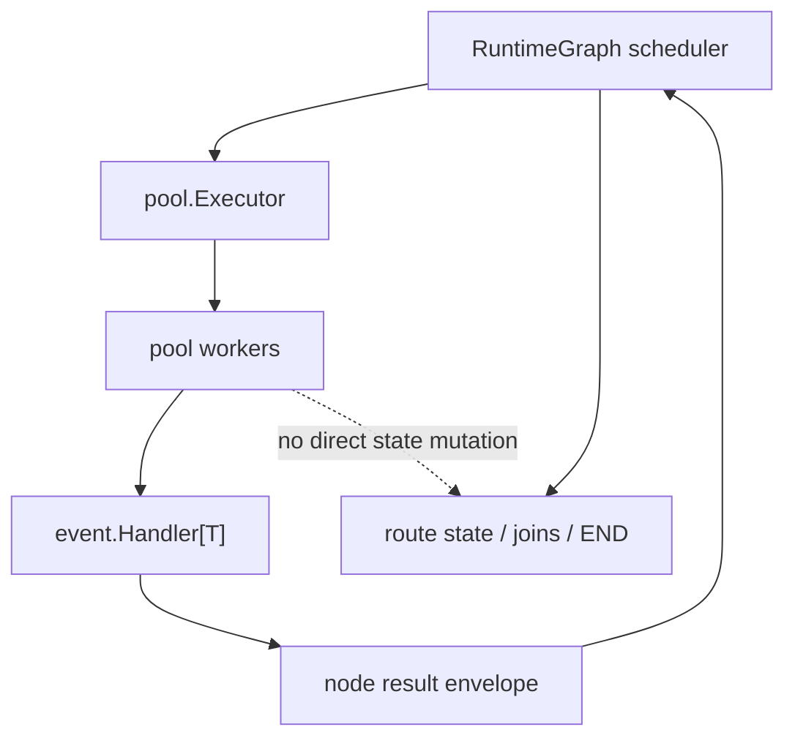

# Disruptor.go V1.4 External Pool Integration Design

## Status

Specification aligned with the current implementation after extracting the
general executor into `github.com/photowey/pool.go`.

Release line: `v1.4.x`

## Architecture



## Objectives

- Keep disruptor.go focused on RingBuffer, processors, static Graph, and
  RuntimeGraph routing.
- Use `pool.Executor` as the external execution abstraction for caller-owned
  RuntimeGraph node execution.
- Keep `WithRuntimeGraphWorkers` as the built-in convenience option for a
  Disruptor-owned bounded pool.
- Keep `WithRuntimeGraphExecutor` as the advanced extension point for
  caller-owned executors.
- Ensure the RuntimeGraph scheduler owns route state, edge evaluation, joins,
  END/no-route decisions, exception policy, and sequence advancement.
- Ensure workers only run selected node handlers and return completion envelopes
  to the scheduler.
- Keep default RuntimeGraph behavior deterministic when workers are not
  configured.

## Out Of Scope

- A disruptor.go-owned general executor, Future, Promise, or composition API.
  Those APIs belong to `github.com/photowey/pool.go`.
- Dynamic pool resizing.
- Work stealing.
- RuntimeGraph parallel execution as the default mode.

## Public API Shape

```go
func WithRuntimeGraphExecutor[T any](
    executor pool.Executor,
) RuntimeGraphOption[T]
```

The executor is caller-owned. Disruptor dispatches selected RuntimeGraph node work
to it and waits for node completion through the RuntimeGraph scheduler. Disruptor
does not shut down caller-owned executors.

```go
exec, err := pool.NewFixed(
    4,
    pool.WithQueueSize(4),
    pool.WithRejectPolicy(pool.RejectPolicyReject),
)
if err != nil {
    return err
}
defer exec.Shutdown(ctx)

_, err = d.HandleRuntimeGraph(
    runtimeGraph,
    disruptor.WithRuntimeGraphExecutor[LongEvent](exec),
)
```

`WithRuntimeGraphWorkers` and `WithRuntimeGraphExecutor` are mutually exclusive.
`WithRuntimeGraphWorkers(1)` keeps inline execution. Worker counts greater than
one create an internal pool owned and shut down by Disruptor.

## RuntimeGraph Scheduling Invariant

```text
scheduler owns state, pool owns handler execution
```

The scheduler creates a task per ready selected node. A task receives an
event-scoped request and sends one node result envelope back to the scheduler.
If queued work is cancelled before execution, the task reports cancellation
through the same envelope path so the scheduler cannot wait forever.

## Quality Gates

- `go test ./...`
- `go test -race ./pkg/disruptor`
- `go test -run '^$' -bench='Benchmark(RuntimeGraphRouting|RuntimeGraphRoutingParallel)' -benchmem -count=1 ./benchmarks`
- Run a repository-wide legacy executor reference scan.
